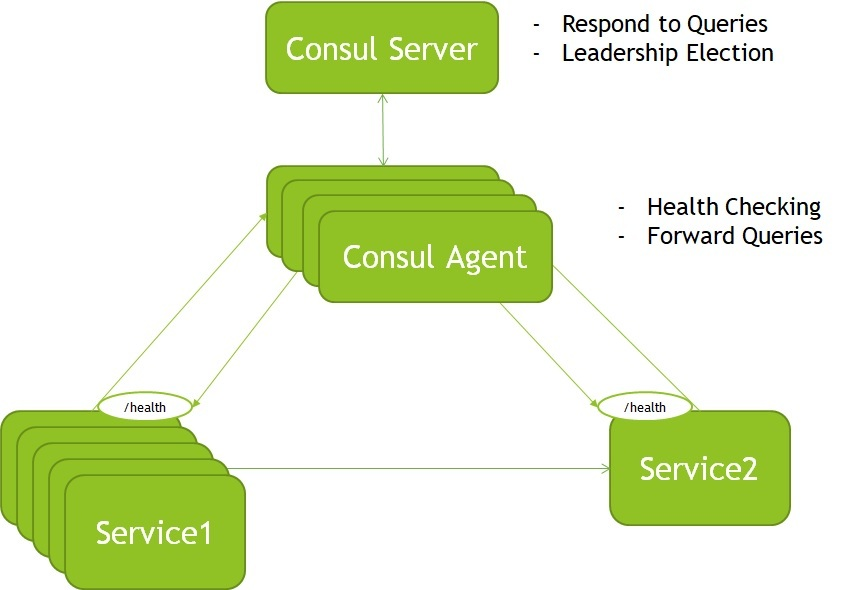

* 目录
{:toc}

# 总览

在本教程中，我们将看到Consul的领导者（Leader）选举如何帮助确保数据稳定性。我们将提供一个实际的示例，说明如何在并发应用程序中管理分布式锁定。

# 什么是Consul

[Consul](https://www.consul.io/)是一个开源工具，可基于运行状况检查提供服务注册和发现。此外，它还包括一个Web图形用户界面（GUI），以查看Consul并轻松与之交互。它还涵盖了会话管理和键值对（KV）存储的额外功能。

在下一节中，我们将重点介绍如何使用Consul的会话管理和KV存储来选择具有多个实例的应用程序中的领导者（Leader）。

# Consul基本原理

**[Consul agent](https://www.consul.io/docs/agent)是在Consul群集的每个节点上运行的最重要的组件。** 负责健康检查；注册，发现和解析服务；存储配置数据；以及更多。

Consul agent可以在**两种不同的模式下**运行 - 服务器（Server）和代理（Agent）。

**Consul Server的主要职责**是响应来自代理人的查询并选举领导者（Leader）。使用[共识协议](https://www.consul.io/docs/architecture/consensus)选择领导者，以基于[Raft算法](https://raft.github.io/raft.pdf)提供[一致性（由CAP定义）](https://en.wikipedia.org/wiki/CAP_theorem)。

详细讨论共识的工作原理不在本文的讨论范围之内。但是，值得一提的是，节点可以处于以下三种状态之一：领导者（Leader），候选者（Candidate）或关注者（Follower）。它还存储数据并响应来自代理人的查询。

**代理模式比Consul的服务器模式更轻巧。** 它负责运行已注册服务的运行状况检查，并将查询转发到服务器。让我们看一下Consul集群的简单图：



**Consul还可以以其他方式提供帮助 - 例如，在并发应用程序中，其中一个实例必须是领导者（Leader）。** 并且在Consul中，允许节点只有一个，随着节点的增加，可容忍的失败节点数量也增加。对于N个节点，至少需要`(N/2)+1`个法定成员。如：总共有5个节点，必须保证`(5/2)+1`个法定成员，也就是允许其他2个成员是失败的。

在接下来的部分中，让我们看看Consul如何通过会话管理和KV存储来提供这一重要功能。

# Consul领导者选举

在分布式部署中，持有锁的服务是领导者。因此，对于高可用的系统，管理锁和领导者至关重要。

Consul提供了易于使用的KV存储和[会话管理](https://www.consul.io/docs/dynamic-app-config/sessions)。这些功能有助于[建立领导者选举](https://learn.hashicorp.com/tutorials/consul/application-leader-elections)，因此让我们了解其背后的原理。

## 领导权争夺

**属于分布式系统的所有实例要做的第一件事就是争夺领导权。** 成为领导者的争论包括以下步骤：
- 所有实例都必须商定要争用的公用密钥。
- 接下来，实例通过Consul会话管理和KV功能使用约定的密钥创建会话。
- 第三，他们应该参加会议。如果返回值为true，则该锁属于该实例；如果为false，则该实例为跟随者。
- **在失败或释放的情况下，实例需要持续监视会话以再次获得领导权。**
- 最后，领导者可以释放该会话，然后该过程再次开始。

选定领导者后，其余实例将使用Consul KV和会话管理通过以下方式发现领导者：

- 检索同意的密钥
- 获取会话信息以了解领导者

## 一个实际的例子

我们需要在Consul中运行多个实例的情况下，创建键和值以及会话。为了解决这个问题，我们将使用[Kinguin Digital Limited Leadership Consul](https://jitpack.io/p/kinguinltdhk/leadership-consul)开源Java实现。

首先，让我们添加依赖项：
```
<dependency>
   <groupId>com.github.kinguinltdhk</groupId>
   <artifactId>leadership-consul</artifactId>
   <version>${kinguinltdhk.version}</version>
   <exclusions>
       <exclusion>
           <groupId>com.ecwid.consul</groupId> 
           <artifactId>consul-api</artifactId>
       </exclusion>
   </exclusions>
</dependency>
```

我们排除了consul-api依赖性，以避免在Java中的不同版本上发生冲突。

对于公共密钥，我们将使用：
```
services/%s/leader
```

让我们用一个简单的代码片段测试所有过程：
```java
new SimpleConsulClusterFactory()
.mode(SimpleConsulClusterFactory.MODE_MULTI)
.debug(true)
.build()
.asObservable()
.subscribe(i -> System.out.println(i));
```

然后，我们使用`asObservable()`创建具有多个实例的集群，以供订阅者访问事件。领导者在Consul中创建一个会话，并且所有实例都会验证该会话以确认领导。

最后，**我们自定义consul配置和会话管理，** 以及实例之间的商定密钥以选举领导者：
```
cluster:
  leader:
    serviceName: cluster
    serviceId: node-1
    consul:
      host: localhost
      port: 8500
      discovery:
        enabled: false
    session:
      ttl: 15
      refresh: 7
    election:
      envelopeTemplate: services/%s/leader
```

## 如何测试

有几种安装Consul和[运行代理](https://www.baeldung.com/spring-cloud-consul#prerequisites)的选项。

部署Consul的可能方式之一是通过[容器](https://www.baeldung.com/docker-images-vs-containers#running-images)。我们将使用Docker Hub中的[Consul Docker](https://hub.docker.com/_/consul)镜像。

我们将通过运行以下命令使用Docker部署Consul：
```
docker run -d --name consul -p 8500:8500 -e CONSUL_BIND_INTERFACE=eth0 consul
```

Consul现在正在运行，它应该在`localhost:8500`可用。

让我们执行代码片段并检查已完成的步骤：
1. 领导者在Consul中创建一个会话
2. 然后，它被选为（首次选举）
3. 其余实例将一直监视直到会话释放

```
INFO: multi mode active
INFO: Session created e11b6ace-9dc7-4e51-b673-033f8134a7d4
INFO: Session refresh scheduled on 7 seconds frequency 
INFO: Vote frequency setup on 10 seconds frequency 
ElectionMessage(status=elected, vote=Vote{sessionId='e11b6ace-9dc7-4e51-b673-033f8134a7d4', serviceName='cluster-app', serviceId='node-1'}, error=null)
ElectionMessage(status=elected.first, vote=Vote{sessionId='e11b6ace-9dc7-4e51-b673-033f8134a7d4', serviceName='cluster-app', serviceId='node-1'}, error=null)
ElectionMessage(status=elected, vote=Vote{sessionId='e11b6ace-9dc7-4e51-b673-033f8134a7d4', serviceName='cluster-app', serviceId='node-1'}, error=null)
```

Consul还提供了一个Web GUI，可从`http://localhost:8500/ui`获得。

让我们打开浏览器，然后单击Key/Value部分以确认已创建会话。

因此，并发实例之一使用应用程序的约定密钥创建了会话。只有释放会话后，流程才能重新开始，新实例才能成为领导者。

# 总结

在本文中，我们展示了具有多个实例的高性能应用程序中的领导选举基础。我们演示了Consul的会话管理和KV存储功能如何帮助获得锁并选择领导者。


[Leadership Election With Consul](https://www.baeldung.com/consul-leadership-election)