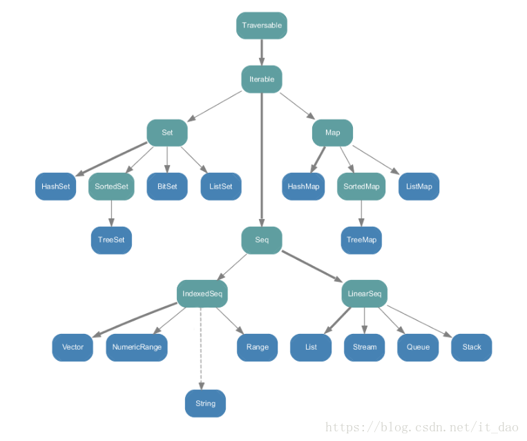

* 目录
{:toc}

#### 声明与废话在前 

因为我不是零基础，所以不再列举简单的。只记录稍微重点的。希望能帮助到你们，也当是自己的复习，学习的记录。目前主要做自动化、测试平台与工具开发（Java）
本人未来的目标不出意外也是做类似的框架或工具开发。学习scala的初衷并不是为了大数据，而是学习函数式的思想，这不受影响。
注意：为了方便 使用@see 标记相关的代码类名，而具体代码放在（本包对象）外面，方便运行。

PS:本人已转Scala服务端后台开发

* 本库由个人业余维护，不定期，目前寻找合作人中...并补充实战部分
  
参考书籍：

《Scala编程第三版》、《响应式架构 消息模式Actor实现与Scala、Akka应用集成》，《快学Scala》入门 （不是很友好）
 
#### 前情提要 

    /**
     * scala特点
     *
     * Scala是面向对象语言
     * Scala是一种纯粹的面向对象语言，每一个值都是一个对象。 对象的类型和行为由类和特征描述。
     * 类通过子类化和基于灵活的基于混合组合机制进行扩展，作为多重继承的干净替代。
     *
     * Scala是函数式编程语言
     * Scala也是一种函数式语言，每个函数都是一个值，每个值都是一个对象，所以每个函数都是一个对象。
     * Scala提供了一个轻量级的语法来定义匿名函数，它支持高阶函数，它允许函数嵌套，并支持currying。
     *
     * Scala是静态类型的
     * Scala与其他静态类型语言(C，Pascal，Rust等)不同，它不提供冗余类型的信息。 在大多数情况下，您不需要指定类型，当然减少了不必的重复。
     *
     * Scala运行在JVM上
     * Scala代码被编译成由Java虚拟机(JVM)执行的Java字节代码，这意味着Scala和Java具有通用的运行时平台。因此，可以轻松地从Java迁移到Scala。
     * Scala编译器将Scala代码编译成Java字节代码，然后可以通过scala命令执行。scala命令类似于java命令，因为它执行编译Scala代码。
     * （PS：混合编程或迁移Java实际会出现不少问题）
     *
     * Scala可以执行Java代码
     * Scala能够使用Java SDK的所有类以及自定义Java类，或您最喜欢的Java开源项目。
     *
     * Scala可以做并发和同步处理
     * Scala允许您以有效的方式表达一般的编程模式。它减少了线路数量，并帮助程序员以类型安全的方式进行编码。
     * 它允许您以不变的方式编写代码，这使得应用并发和并行性(Synchronize)变得容易。
     */

    /**
     * Scala与JavaScala具有与Java完全不同的一组功能，其中的一些如下
     * -所有类型都是对象
     * 类型推断
     * 嵌套函数
     * 函数是对象
     * 域特定语言(DSL)支持
     * 模式匹配
     * 性状/特质
     * 闭包
     * 并发支持
     * 灵感来自Erlang
     */

    /**
     * Scala Web框架
     *
     * Lift Framework
     * Play Framework
     * Bowler Framework
     */

    /** 闭包 - 闭包是一个函数，其返回值取决于在此函数之外声明的一个或多个变量的值。
     *
     * Scala中的保留字(关键字)，这些保留字不能用作常量或变量或任何其他标识符名称。
     * abstract    case       catch      class
     * def         do         else	     extends
     * false       final      finally    for
     * forSome     if         implicit   import
     * lazy	       match	  new	     null
     * object      override   package    private
     * protected   return     sealed     super
     * this	       throw	  trait	     try
     * true	       type       val	     var
     * while       with       yield
     * -	         :         =          =>
     * <-	         <:        <%         >:
     * #	         @
     *
     */

    /**
     * scala的数据类型 - 全部是类，不存在基础类型
     * 1	Byte	8位有符号值，范围从-128至127    java-byte
     * 2	Short   16位有符号值，范围从-32768至32767 -java-short
     * 3	Int     32位有符号值，范围从-2147483648至2147483647  java-int
     * 4	Long	64位有符号值，范围从-9223372036854775808至9223372036854775807  java-long
     * 5	Float	32位IEEE 754单精度浮点值  java-float
     * 6	Double	64位IEEE 754双精度浮点值  java-double
     * 7	Char	16位无符号Unicode字符。范围从U+0000到U+FFFF  java-char
     * 8	String	一个Char类型序列 java-String
     * 9	Boolean	文字值true或文字值false java-boolean
     * 10	Unit	对应于无值  类似java-void 执行无返回值方法完全是为了副作用：如打印
     * 11	Null	null或空引用  java-null
     * 12	Nothing	每种其他类型的亚型; 不包括无值
     * 13	Any     任何类型的超类型; 任何对象的类型为Any
     * 14	AnyRef	任何引用类型的超类型
     */

Scala类型系统继承结构图


    /**
     * 方法参数方法参数是在调用该方法时用于传递方法中的值的变量。
     * 方法参数只能从方法内部访问，但是如果从方法外部引用了对象，则可以从外部访问传入的对象。
     * 方法参数始终是不可变的，由val关键字定义。（这里有坑，val是隐式定义的，自己写的时候没有写val也是不可变，函数每次调用的时候val有重写的值，所以val不能说是常量，绝对的常量应该加final）@see scala.math.Pi
     * 可变变量用var定义。应该尽量使用val @see Test3.scala
     * 不能对数值进行++ --操作，Scala不支持 @see Test2.scala
     *
     */
     
    /** 需要特别注意scala的访问权限
     * 1、访问控制符
     * Scala 访问修饰符基本和Java的一样，分别有：private，protected，public。
     * 如果没有指定访问修饰符符，默认情况下，Scala 对象的访问级别都是 public。
     * Scala 中的 private 限定符，比 Java 更严格，在嵌套类情况下，外层类不能访问被嵌套类的私有成员。（内部可以访问外层的私有，不如内部/层就没意义了。。。）
     *
     * @see ObjectBasic.scala->OutPrivateClass.scala | TestInnerPrivateClass.scala
     **/

    /** 在 scala 中，对保护（Protected）成员的访问比 java 更严格一些。因为它只允许保护成员在定义了该成员的的类的子类中被访问。
     * 而在java中，用protected关键字修饰的成员，除了定义了该成员的类的子类可以访问，同一个包里的其他类也可以进行访问。
     * *
     * Scala中，如果没有指定任何的修饰符，则默认为 public。这样的成员在任何地方都可以被访问。
     * Java默认是default，权限大于private但是小于protected
     * */

    /** 2、作用域保护
     * Scala中，访问修饰符可以通过使用限定词强调。格式为:
     * private[x]
     * 这里的x指代某个所属的包、类或单例对象。如果写成private[x],读作"这个成员除了对[…]中的类或[…]中的包中的类及它们的伴生对像可见外，对其它所有类都是private。
     * 这种技巧在横跨了若干包的大型项目中非常有用，它允许你定义一些在你项目的若干子包中可见但对于项目外部的客户却始终不可见的东西。
     * */

    /** 3、Scala 函数
     * 函数是一组一起执行一个任务的语句。 您可以把代码划分到不同的函数中。如何划分代码到不同的函数中是由您来决定的，但在逻辑上，划分通常是根据每个函数执行一个特定的任务来进行的。
     * Scala 有函数和方法，二者在语义上的区别很小。Scala 方法是类的一部分，而函数是一个对象可以赋值给一个变量。换句话来说在类中定义的函数即是方法。
     * 我们可以在任何地方定义函数，甚至可以在函数内定义函数（内嵌函数）。更重要的一点是 Scala 函数名可以有以下特殊字符：+, ++, ~, &,-, -- , \, /, : 等。
     * 通过使用特殊字符可以模仿操作符重载，使得用户定义的函数可以像scala语言本身关键字、操作符那样方便调用：典型的akka !发送消息
     * */

    /** 4、函数声明
     * Scala 函数声明格式如下：
     * def functionName ([参数列表]) : [return type]
     * 如果你不写等于号和方法主体，那么方法会被隐式声明为"抽象(abstract)"，包含它的类型于是也是一个抽象类型。
     * */

    /** 5、函数定义
     * 方法定义由一个def 关键字开始，紧接着是可选的参数列表，一个冒号"：" 和方法的返回类型，一个等于号"="，最后是方法的主体。
     * Scala 函数定义格式如下：
     * def functionName ([参数列表]) : [return type] = {
     * function body
     * return [expr]
     * }
     * 如果函数没有返回值，可以返回为 Unit，这个类似于 Java 的 void，return可以省略，默认返回最后一个表达式（计算）的值，
     * 返回为空的称作过程，我们只是使用它的副作用，如打印
     *
     * 函数内部定义的函数只能在当前作用域被访问，且可以使用外部函数的参数，内部函数可以用于替代private函数【方法是特殊的属于对象成员的函数】
     * */

    /** 6、函数调用 @see Test3.scala
     * Scala 提供了多种不同的函数调用方式：
     * 以下是调用方法的标准格式：
     * functionName( 参数列表 )
     * 如果函数使用了实例的对象来调用，我们可以使用类似java的格式 (使用 . 号)：
     * [instance.]functionName( 参数列表 )
     * 传名调用（call-by-name）：将未计算的参数表达式直接应用到函数内部
     * */

    /** 7、Scala 高阶函数
     * 高阶函数（Higher-Order Function）就是操作其他函数的函数。
     * Scala 中允许使用高阶函数, 高阶函数可以使用其他函数作为参数，或者使用函数作为输出结果。
     * 以下实例中，apply() 函数使用了另外一个函数 f 和 值 v 作为参数，而函数 f 又调用了参数 v：
     *
     * @see Test1.scala
     **/

    /** 三要素
     *
     *  函数式编程核心理念：
     *  函数是一等的值
     *  不可变数据结构、无副作用
     */
     
#### class 小目录 
     
    /**
     * Scala的main方法执行 @see SingletonObject.scala、Test2.scala
     * Scala的for循环中断和List的交并差 @see LoopBasic.scala
     * Scala的数组 @see Test3.scala、Test4.scala
     * Scala中的方法调用 操作符表示法 @see Test4.scala
     * Scala的列表 @see Test6.scala
     * Scala的元组 @see Test7.scala
     * Scala的集合和映射(map) @see Test8.scala
     * Scala的可变集合主要用于命令式传统编程（当Java用），不可变主要用于函数式编程，推荐使用不可变，减少副作用，也更加安全 @see immutable.png、mutable.png
     * Scala从文件读取 @see IOBasic.scala、Test10.scala、Test11.scala
     * Scala 面向对象的类、单例对象、构造函数、序列化、注解、重写、重载、函数字面量等  @see ObjectBasic.scala FunctionObjects.scala Function.scala
     * Scala基础语法图解 @see Scala语法图解.png  （已经取得作者本人同意）
     **/

}

此图由playscala.cn作者作，并授权使用

Scala基本语法图解


PS:每个markdown的Scala代码块原本是一个class，但是这样文件太多不方便查看，现已经被直接放到本md中。

#### Scala 基础语法 

```scala
object Test1 {
    // scala 数组下标用(),泛型用[]，@see Test3.scala
    def main(args: Array[String]) {
        println(apply(layout, 10))
        useLambda()
    }

    // 函数 f 和 值 v 作为参数，而函数 f 又调用了参数 v
    def apply(f: Int => String, v: Int) = f(v)

    def layout[A](x: A) = "[" + x.toString() + "]"

    //声明一个lambda
    //实现对传入的两个参数进行凭借,lambda可以当做def使用
    val lambda = (param1: String, param2: String) => param1 + param2

    def useLambda(): Unit = {
        println(lambda("hello", "world"))
    }
}
```
```scala
object Test2 extends App {
    // 继承App 默认有main方法，自己也可以重写main。或者不继承App，自己写main方法，签名需一致
    val string: String = "ABCabc"
    val hasUpper = string.exists(_.isUpper) //_.isUpper是函数字面量，其中_占位符(args:type)=> func body
    println(hasUpper)

    var i = 0 //scala不能用i++ ++i --i i--
    i += 1
    println(i)

    val str = "hello" +
      "world"; //+操作符放在末尾，而不是java那样推荐在前面
    Console println str

    println {
        "hello"
    } //只有一个参数的方法调用可以使用花括号


    // string.chars().anyMatch((int ch)-> Character.isUpperCase((char)ch)) //java 8
}
```
```scala
object Test3 extends App {
    val arr = new Array[String](3) //这种方式不是函数式编程推荐的，推荐方法@see Test5.scala
    // arr=new Array(2) val不能被重新赋值，但是本身指向的对象可能发生改变比如：改变arr数组内容
    arr(0) = "hello1" //实际上，Scala数组赋值也是函数调用，arr(i)底层调用了apply(i)方法，这是与其他方法调用一致的通用规则
    arr(1) = "hello2" //arr(i) = "hello" 实际上底层调用了update方法 arr.update(0,"hello")
    arr(2) = "hello3"
    arr.foreach(println)
}
```
```scala
//循环中断@see LoopBasic.scala
object Test4 extends App {

    for (i <- 0 to 2) //to包含了右边界  to实际是(0).to(2)的缩写，to返回一种包含了0、1、2的序列。对于单参数方法的调用时  () . 可以被省略
        println(i)
    println("==========================")
    for (i <- 0 until 2) //until不包含右边界 其他同
    // println(i)
        Console println i //省略括号需要显示的给出方法调用的目标对象才有效，此时println是操作符
    //实际上在Scala中任何操作符都是一种方法调用，而任何方法也可以是操作符，但是在多参数的情况下，操作符表示法必须用括号:strings indexOf ('a',startIndex)
    val s = "hello"
    s toLowerCase //无参，无副作用不用括号,使用后缀需要隔断，用分号
    println() //有副作用用括号
    var num = -1 //-是前缀操作符，实际也是方法调用 可用的前缀操作符：！ + - ~  都是一元的
    var num2 = 1.unary_- // unary_是混合操作符 yield在Scala是关键字，需要使用反引号`yield`，其他如match类似
    if (num == num2) println(true) //true 都是-1，Scala的==比较的是值的相等性，不同于Java的==（比较引用的地址或者基本类型的值），但是Scala的值比较自动处理null
    //且样例类可以直接使用值比较（==），因为样例类实现了很多譬如：equals、toString等方法 @T
    //若想要比较引用地址可用eq/ne方法，不过这只对Scala对象直接映射到Java对象的对象有效。比如String
    println("======================new eq=====================")
    val str1 = new String("hello")
    val str2 = new String("hello")
    var str3 = "hello"
    var str4 = "hello"
    if (str1 eq str2) println("比较地址") //无输出
    if (str1 == str2) println("==比较内容") //输出
    if (str1 equals str2) println("equals比较内容") //输出
    println("======================常量 eq=====================")
    if (str3 eq str4) println("比较地址") //输出，指向同一个常量池的引用
    if (str3 == str4) println("==比较内容") //输出
    if (str3 equals str4) println("equals比较内容") //输出

}
object HashEquals extends App {

    val intVal = new Integer(1)
    val longVal = new lang.Long(2) //不加包名的话，默认导入scala.Long

    println(intVal == longVal) //输出true，Scala中==等同于equals

    println(intVal.##) //scala hashcode
    println(longVal.##)


    println(intVal eq (longVal)) //false,比较引用的相等性，效果等同于Java的引用比较（Ref1==Ref2）
    println(intVal ne (longVal)) //true,引用不等
}
```
```scala
object Test5 extends App {
    val arr = Array("hello", "world")
    arr.foreach(print)
}
```
```scala
object Test6 extends App {
    //List是具体实现，函数式不可变集合，相当于Java的LinkedList，但是Java没有不可变对象，它们不完全相同。Sequence相当于Java的List
    val list = List(1, 2, 3) //不需要new，使用函数风格的调用，底层调用了List的伴生对象的工厂方法List.apply()
    //val list = 1::2::3::4::Nil 更麻烦的初始化方法，必须用Nil，因为4是整形没有::方法
    list.foreach(print)
    println()

    val list1 = List(1, 2, 3)
    println("列表拼接")
    val list2 = list ::: list1
    list2.foreach(print)
    println()

    println("向列表头部追加元素")
    val list3 = 2 :: list //以冒号结尾的操作符，方法调用发生在右边，其他的都发生在左边
    //list3.:+(2)//效率低，每次都需要从头部移动到尾部，可以使用ListBuffer可变列表或者使用头部追加再反转列表
    list3.foreach(print)
    println()

    println("=================列表操作================")
    val list4 = List("hello", "world", "12344")
    val ret = list4.count(s => s.length == 5)
    println("列表中字符串长度为5的个数：" + ret)

    println("按照首字母排序")
    //不改变原列表
    val list5 = ListBuffer("hello", "world", "hello")
    val list6 = list5.sortWith((s, t) => s.charAt(0).toUpper < t.charAt(0).toUpper) //与元组不同，List从0开始
    list6.foreach(print)
    println()
}
```
```scala
object Test7 extends App {
    val tuple1 = (11, "hello") //可见，类型可以不同。同样元组也是不可变
    print(tuple1._1) //打印第一个，从1开始，跟随Haskell、ML等静态类型元组设定的语言传统
    print(tuple1._2) //打印第一个，标准库最大22个元组(从概念上可以创建任意长度)
    // print(tuple1(1))//不能使用下标，因为apply是只能返回同种类型
}
```
```scala
object Test8 extends App {

    println("================Set集===========")
    //创建并初始化，不可变Set集合，类似数组，也是调用了伴生对象的apply方法
    var set = Set("hello", "world") //默认集合都是不可变的， 其他集：var hashSet = HashSet("hello","world")
    set += "hhh" //实际是“+”方法[set = set + "hhh"]， 创建并返回新集合，无论是可变还是不可变集
    println(set.contains("hello"))
    // 注意：因为对不可变集使用+=实际是调用+=方法set1.+=("hhh")，所以表达式不需要重新赋值，set1可以是val
    // 而对于可变集，+=实际是+调用后再进行赋值，所以不能为val
    //对于只有一个参数的方法调用可以省略 . () ，所以set1.+=("hhh") ===> set1 += "hhh"
    val set1 = scala.collection.mutable.Set("hello", "world") //提供+=方法
    set1 += "hhh" //实际是调用方法
    println(set1.contains("hhh"))
    println("===============Set遍历=============")
    set1.foreach(print) //遍历
    println
    println("================Map集===========")
    //创建并初始化可变的Map
    val map = scala.collection.mutable.Map[String, String]()
    map += ("a" -> "b") //实际是(a).->("b")方法调用，同样也是省略了. ()
    map += ("b" -> "c") //底层也是+=的方法调用，所以map也可以是val
    map += ("c" -> "d") //Map("hello"->"world","a"->"b")默认是不可变，不再解释
    map.foreach { case (k, v) => println(k + v) } //用小括号报错，，，
    println(map("b"))
    println("=============单独获取key、value============")
    //获取key
    val keys = map.map(_._1) //前面一个占位符表示map的任意元素，后面一个表示任意元素的第一个元素，即 key
    keys.foreach(print)
    println
    //获取value
    val valus = map.map(_._2) //类似
    valus.foreach(print)
    println
    println("===========将两个list转化为一个map===============")
    //反向操作可以使用zip，其中一个list作为key，另一个作为value
    val list = List(1, 2, 3, 4)
    //以少的为基准，不够舍弃
    val scores = list.zip(valus).toMap //list作为key,values作为value
    scores foreach { case (k, v) => println(k + v) }

}
```
```scala
/**
 * P138 例子
 *
 * 函数式输出乘法表
 */
object PrintMultiTable extends App {

    val ret = multiTable()

    println {
        ret
    }

    def makeRowSeq(row: Int) =
        for (col <- 1 to 10) yield {
            val prod = (row * col).toString
            val padding = " " * (4 - prod.length)
            padding + prod
        }

    def makeRow(row: Int) = makeRowSeq(row).mkString

    def multiTable() = {
        val tableSqe = for (row <- 1 to 10) yield makeRow(row)

        tableSqe.mkString("\n")
    }

}
```
不可变集合继承结构


可变集合继承结构


#### Scala 面向对象 

```scala
package cn.edu.jxnu.scala

class ObjectBasic {


    private val str1 = "hello"

    def print(): Unit = {
        println(ObjectBasic.str2)
    }

    // 源文件名称可以和类名不同
}

/**
 * ============================构造函数、实例化规则==============================================
 */
//伴生对象与伴生类同名，同一源文件中
//注意单例对象是一等的，是特殊的class
object ObjectBasic extends App {
    //启动Scala程序
    //1.混入App，默认就可以执行里面的语句
    //2.增加自己的main方法
    //3.混入特质并重写main
    //继承/混入APP特质
    //单例可以混入特质
    private val str2 = "world"
    val companionClass = new ObjectBasic() //new只能实例化类
    println(companionClass.str1) //单例对象类似Java的static方法调用
    companionClass.print() //可以互相访问对方的私有属性，方法

}

class Construction {
    //class有主构造器和辅助构造器，辅助构造器第一行代码须用调用主构造器（例外可以是：另一个调用了主构造的辅助构造）
    def this(var1: String) = {
        //无返回值类型
        this() //因为此时默认的主构造就是无参
    }
}

//使用var表示在类的内层和外层均可以修改（因为生成字段var1，和var1的set方法）
//var1不使用val、var修饰则Scala不会为其生成字段以及访问器，只能暂时使用该变量
class Construction2(var1: String, var2: String) {
    //类结构可以嵌入主构造，此时主构造就是2个参数
    //定义一个参数的辅助构造
    def this(var1: String) = {
        this(null, "hello") //同样需要第一行调用主构造，或者是调用另一个出现在发起调用的构造方法之前的另一个辅助构造
    }
}

//val这种是常见情况
//类定义可以不需要花括号
class Construction3(val var1: String, val var2: String) {
    def print(string: String) = println(string)
}

//序列化使用注解（非要使用Java的也可以，基础这个接口即可）
//注意：使用注解需要加一对括号
//构造函数里面加也可以
//重写父类的非抽象成员需要使用override
//在scala中，若有继承，那么，只有主构造函数才能将参数的值传递到父类的构造函数中去。
//继承父类时，必须用父类的主构造函数，并且传入参数，与上一句一个意思
class Construction4 @SerialVersionUID(1L)(override val var1: String, override val var2: String) extends Construction3(
    var1, var1) {

    //Trait的线性化细节描述Scala编程P238
    //1.java的super是静态绑定的
    //在java（单一继承）里面，假设有一个对象a，它既是类型X，又是类型Y，那么X和Y必定具有“父子关系”，也就是说，其中一个是另一个的父类。
    //因为java的继承是单一继承，不管实际类型是什么，一个对象的“继承链”，从super所在类开始往左的层分，都是在编译时期就可以确定下来的。
    //2.scala的super是动态绑定的（类中还是静态绑定的）
    //在scala（多重继承）里面，假设有一个对象a，它既是trait X，又是trait Y， X和Y可能具有父子关系，也可能是共享同一个祖先的“兄弟”，反正，它们的关系不再限定在“父子”上。
    //因为scala允许多重继承，父亲类和trait们的优先顺序，是由对象的实际类型的线性化结果决定的，所以需要动态绑定。
    //3.调用方法，有三种情况，如下
    //    （1）当你看到 obj.method 的时候，你想知道实际被执行的是哪个类或者trait里的method：
    //    你首先要知道obj所指向的对象的“实际类型”，然后做线性化，然后，从线性化得到的“链”的最右边的类或者trait开始，往左边查找，首先找到的那个method就是实际被执行的方法。
    //    （2）当你看到 this.method 的时候（this可能被省略），你想知道实际被执行的是哪个类或者trait里的method：
    //    你首先要知道this所指向的对象的“实际类型”，然后做线性化，然后，从线性化得到的“链”的最右边的类或者trait开始，往左边查找，首先找到的那个method就是实际被执行的方法。
    //    （3）当你在某个类或者trait X 里面看到super.method的时候，你想知道实际被执行的是哪个类或者trait里的method：
    //    你首先要知道这个super所指向的对象的“实际类型”，然后做线性化，然后，从线性化得到的“链”里，从X开始往左边找（不包括X本身），首先找到的那个method就是实际被执行的方法。
    //    需要注意的是上述是针对特质，抽象类仍然是单继承
    def this() {
        this(null, null) //使用空构造，也需要调用主构造并传入null，因为默认自己写了有参的主构造，就不再提供无参主构造
        super.print("hello world") //排除自身从左开始就是：Construction3类
    }

}

//仅是演示，混入多个特质
class Trait extends Serializable with Comparable[String] with Iterable[String] {

    //特质的特点：与Java8的接口很像，但功能更强大
    //特质可以声明字段并保持状态，特质可以做任何在类中能做的事，除了两种情况
    //1.无类参数（主构造函数是无参的）
    //2.特质中super是动态绑定的，类中是静态绑定的

}

//样例类的主构造必须得有参数
//初始化可以省略new
//因为默认自带equals、toString等。可以使用==比较，也可以使用println直接打印内容
//match模式匹配时用的比较多
//默认生成自己的伴生对象
case class Construction5(name: String, pws: String = "pass")

object TestcaseClass extends App {

    val jack = Construction5("name", "password")
    val rese = Construction5("name")
    println(jack, rese)
    val name = jack.name //样例类的实例内容可以直接打印
    println(jack.name == "name", rese == Construction5("name"))

}

/**
 * ==============================内层类，访问权限============================
 **/
object OutPrivateClass extends App {

    private val name: String = "hello"

    //    def getInnerName = println(InnerPrivateClass.innerName) //编译出差，禁止访问内层单例的私有

    object InnerPrivateClass {

        private val innerName: String = "hello"

        def test() = print(name)
    }

    InnerPrivateClass.test() //内层单例，可以读取外层单例的私有属性

}

class OutPrivateClass {
    //外层类别名，这之间不能有任何代码
    outer =>

    class InnerPrivateClass2 {
        //访问内层类的私有，拒绝访问
        // private val innerName = "world"//
        //可以访问
        val innerName = "world"

        def info() = println("访问外层类的私有属性试试：" + name)

        // 在内层类通过【外层类.this.成员名称】 访问外层类成员
        def info1 = println("Outer name :" + OutPrivateClass.this.name + ",Inner Name :" + name)

        //在内层类通过【外层类别名】 访问外层类成员
        def info2 = println("Outer name :" + outer.name + ",Inner Name :" + name)

    }

    // 访问内层类的私有，拒绝访问（即使你new了这个对象，你也无法得到私有属性，是非常严格的判定，与Java不同）
    // def getInnerName = new InnerPrivateClass2().innerName
    //可以访问
    def getInnerName = println("外层类访问内层类的属性：" + new InnerPrivateClass2().innerName)

    // private val name: String = "hello" //下面方法均正常输出
    // val name: String = "hello" //下面方法均正常输出
    //限定具体的包的权限
    private[basic] val name: String = "hello" //下面方法均正常输出


}

object TestInnerPrivateClass extends App {

    val out1 = new OutPrivateClass()
    out1.getInnerName
    val inner1 = new out1.InnerPrivateClass2() //注意：Scala内层类是从属于外层类对象的。类似Java的static内部类的实例方式
    inner1.info()
    inner1.info1
    inner1.info2 //定义的时候不加括号，调用的时候就不能加

    //PS:内部==内层==被嵌套类，外部==外层==嵌套类
}
```
#### Scala 循环结构 

```scala
package cn.edu.jxnu.scala

import scala.util.control.Breaks._

/**
 * Java是指令式风格，Scala是函数式风格。
 * 在Scala中，应该尽量适用循环，而是应用函数的方式来处理。
 * Scala并没有提供break和continue语句来退出循环，那么如果我们又确实要怎么办呢，有如下几个选项：
 * 1. 使用Boolean型的控制变量。
 * 2. 使用嵌套函数，从函数当中return
 * 3. 使用Breaks对象中的break方法(这里的控制权转移是通过抛出和捕获异常完成的，尽量避免使用这套机制)
 * 4. 递归函数重写循环
 * 5. Scala的for是for表达式，更接近函数式
 * 6. 纯函数式for：list.foreach(println) @see loopTest.scala
 */
object LoopBasic {
    //这种是独立对象

    //普通遍历整形数组@see Test4.scala
    def main(args: Array[String]) = {
        val list = List(21, 214, -4352, 65436, 7534)
        val list2 = List(212, 2134, -43522, 651436, 7534)

        println("//差集")
        for (i <- list.diff(list2)) { //--
            print(i + " ")
        }
        println()

        println("//交集")
        for (i <- list.intersect(list2)) { //&
            print(i + " ")
        }
        println()

        println("//并集")
        for (i <- list.union(list2).distinct) {
            //  ++  | distinct去重
            print(i + " ")
        }
        println()

        println("=======================================")
        loopTest(list)

        breakTest1(list)
        breakTest2(list)
        contniueTest1(list)
        continueTest2(list)
        continueTest3(list)

    }

    def loopTest(list: List[Int]): Unit = {
        println("函数式遍历")
        //list.foreach(args => print(args + " "))
        list.foreach(println)
        println()
        println("================================")
    }

    def breakTest1(list: List[Int]) = {
        println("breakable语句块来实现break操作")
        breakable {
            for (elem <- list)
                if (elem < 0) break else println(elem)
        }
    }

    def breakTest2(list: List[Int]) = {
        println("增加一个boolean变量作为for循环守卫，while循环同理")
        var foundMinus = false
        for (elem <- list if !foundMinus) {
            if (elem < 0) foundMinus = true else println(elem)
        }
    }

    def contniueTest1(list: List[Int]) = {
        println("breakable语句块来实现continue操作")
        for (elem <- list)
            breakable {
                if (elem < 0) break else println(elem)
            }
    }

    def continueTest2(list: List[Int]) = {
        println("if else控制来实现continue操作")
        for (elem <- list)
            if (elem < 0) () else println(elem)
    }

    def continueTest3(list: List[Int]) = {
        println("递归函数重写循环")

        def next(i: Int): Unit = {
            if (i >= list.size) Unit
            else if (list(i) < 0) next(i + 1)
            else println(list(i))
            next(i + 1)
        }

        next(0)
    }

    //Scala赋值语句返回的不是赋值的那个值而是（）
    var line = ""
    while ((line = readLine()) != "") {
        //这样永远是（）！=“”
        println(line)
    }

    //需要在外部赋值初始化，并在while里面进行更新
    //因为while没有返回值，并且使用了var变量，实际上函数式语言并不推荐。可以使用尾递归替代
}
``` 
#### Scala IO操作 

```scala
package cn.edu.jxnu.scala

import scala.io.Source

/**
 * 从文件读取行，文件写入使用Java IO
 *
 * 从命令行运行不用加包名
 * scala IOBasic.scala IOBasic.scala 后面一个是参数
 */
object IOBasic {

    val file = "D:\\git_project\\cs-summary-reflection\\src\\cn\\edu\\jxnu\\scala\\basic\\IOExamples.scala"
    val liness = Source.fromFile(file).getLines().toList

    def main(args: Array[String]): Unit = {
        //        for (line <- Source.fromFile(file).getLines()) {
        //            println(line.length + " " + line)
        //        }

        //格式化打印
        val maxWidth = widthOfLength(longestLine)

        for (line <- liness) {
            val nums = maxWidth - widthOfLength(line)
            val padding = " " * nums
            println(padding + line.length + " | " + line)
        }

    }

    /**
     *
     * 计算字符数
     */
    def widthOfLength(s: String) = s.length.toString.length

    /**
     * 计算最大长度 函数式方法
     */
    val longestLine = liness.reduceLeft((a, b) => if (a.length > b.length) a else b)

    /**
     * 计算最大长度 普通函数
     */
    def longestLine2() {

        var maxWidth = 0
        for (line <- liness) {
            maxWidth = maxWidth.max(widthOfLength(line))
        }
    }

}


/**
 * 从网络读取
 */
object Test10 extends App {
    val webFile = Source.fromURL("http://www.baidu.com")
    webFile.foreach(print)
    webFile.close()
}

/**
 * 从控制台读取
 *
 * Java的Scanner也可以
 */
object Test11 extends App {
    //控制台交互
    print("Please enter your input:")
    //val line = Console.readLine()//过期
    val line = scala.io.StdIn.readLine()
    println("Thanks,you just typed:" + line)
}
```
#### Scala 函数式与控制抽象

```scala
package cn.edu.jxnu.scala

import java.io.{File, PrintWriter}

/**
 * 函数式对象即是：没有任何可变属性的对象
 */
object FunctionBasic {

}

/**
 * ============================方法重载、重写、前置条件检查、隐式转换==============================
 *
 * n:分子
 * d:分母
 *
 * @see 《Scala编程》 P97
 */
class Rantional(val n: Int, val d: Int) {
    //给构造方法加前置条件
    require(d != 0)

    //    println(n + "/" + d) //构造对象时执行
    //重写非抽象方法，必须加override
    override def toString: String = n + "/" + d

    def this(n: Int) {
        this(n, 1)
    }

    //重载
    def *(that: Rantional): Rantional = new Rantional(that.n * n, that.d * d)

    // 只是为了演示
    def *(i: Int): Rantional = new Rantional(n * i, d * i)

    //重载
    def test() = "test"

    //重载
    def test(name: String) = "test" + name

    //    implicit def intToRational(x: Int) = new Rantional(x) //定义在这里，下面访问不到
}

object TestRantional extends App {
    val r = new Rantional(1, 2) // 打印1/2
    println(r)
    println("================定义操作符==============")
    //    val a = new Rantional(1, 0) // 抛出IllegalArgumentException异常，构建对象失败
    val c = new Rantional(1, 2)
    val ret = r * c
    val ret1 = r.*(c)
    println(ret) // 输出1/4
    println(ret1) // 输出1/4
    println("================重载方法===============")
    println(ret.test("name"))
    println(ret.test)
    println("================隐式转换===============")
    val n = new Rantional(2, 2)
    println(n * 3) // 输出2*3/2*3 //这里不需要隐式转换等同 n.*(3)
    implicit def intToRational(x: Int) = new Rantional(x)

    //可以定义隐式类，作为类型的转换
    println(3 * n) // 上面定义了隐式转换，不报错，否则3.*(n) 会提示3是Int没有*方法
    println(3.*(n)) //等同new Rantional(3,1)*Rantional(2,2)

    /**
     * 隐式类
     * 在scala2.10后提供了隐式类，可以使用implicit声明类，但是需要注意以下几点：
     * 1.其所带的构造参数有且只能有一个
     * 2.隐式类必须被定义在类，伴生对象和包对象里
     * 3.隐式类不能是case class（case class在定义会自动生成伴生对象与2矛盾）
     * 4.作用域内不能有与之相同名称的标示符
     *
     * 转换前提
     * 1.不存在二义性（如例1）
     * 2.隐式操作不能嵌套使用，即一次编译只隐式转换一次(One-at-a-time Rule)
     * Scala不会把 x + y 转换成 convert1(convert2(x)) + y
     * 3.代码能够在不使用隐式转换的前提下能编译通过，就不会进行隐式转换。
     *
     * @param name
     */
    implicit class implicitClass(val name: String) //隐式类必须用要有一个有一个参的主构造方法


}

/**
 * 函数字面量与部分应用函数
 */
object Function extends App {

    //函数字面量，一等函数
    val list = List(1, 2, 3, 4, 5, 6, 5)
    val f = (x: Int) => x > 5 // 函数是一个值
    val ret = list.filter(x => x > 5) //(x:Int) => x >5 缩写去掉类型。隐藏了目标的类型推断。整个filter接受一个函数字面量
    val ret2 = list.filter(f)
    for (r <- ret) {
        println(r)
    }
    for (r <- ret2) {
        println(r)
    }
    //以上效果一样
    //更新省略，精简的写法
    // _ 表示占位符
    val ret3 = list.filter(_ > 5)
    for (r <- ret3) {
        println(r)
    }
    // _>5写成独立的函数会编译不过，因为无法确定类型
    //必须指明类型，且括号不能省略
    val ff = (_: Int) > 5
    // 打印
    println(ff)
    //cn.edu.jxnu.scala.Function$$$Lambda$18/4226387@18c7aca
    val ret4 = list.filter(ff)
    for (r <- ret4) {
        println(r)
    }

    //当使用下划线时，实际是编写一个部分应用的函数，当传入任何需要的参数时，实际是将该函数应用到这些参数上
    //部分应用的函数是一个表达式，可给出部分或者不给出任何参数
    def sum(a: Int, b: Int) = a + b

    //fun是一个函数值，它有sum函数的引用
    val fun = sum _
    val fun2 = sum(1, _: Int) //给出一个默认
    println(fun(2, 3)) //底层调用了 fun.apply(2,3) apply方法由编译器自动生成[实际是在混入了2个参数的Function2特质的函数类里面]
    // sum方法缺失2个参数，所以apply方法含有2个参数

}

/**
 * 其他函数特性
 *
 * 闭包
 */
object Function2 extends App {

    val m = 1
    //引用外部变量
    // 因为闭包实际捕获的是变量本身，所以m被修改后会体现到fun中，即闭包里面仍可以观察到闭包外面的m被修改后的值
    //反过来闭包中对变量的修改，在闭包外也能看到
    val fun = (x: Int) => x + m

    val nums = List(1, 2, 3, 4, 5, 5, 3)

    var sum = 0
    nums.foreach(sum += _)

    println(sum)

    // (x: Int) => x + m  是一个闭包，每次m都是新传入的值
    def sum(m: Int) = (x: Int) => x + m

    // (x: Int) => x + m  是一个闭包，每次m都是固定值
    def sum2(x: Int) = (x: Int) => x + m // 即使方法已经调用并返回了，但是scala编译器会重新组织安排，让被捕获的参数在堆上继续存活
    //无论是val var 或者是参数

}

/**
 * 其他函数特性
 *
 * 重复参数，带名参数，缺省参数
 */
object Function3 extends App {

    //重复参数
    def prt(args: String*) = for (arg <- args) println(arg)

    prt("hello", "world")

    val arr = Array("hello", "world")
    //    prt(arr)//编译报错
    prt(arr: _*) //OK，告诉编译器将arr的每个元素作为参数传进去，而不是将arr作为一个整体

    //带名字参数,字面量/匿名函数不能使用带名参数
    val su = (x: Int, y: Int) => x + y
    //    val suu = su(y = 1, x = 2)

    def sum(x: Int, y: Int) = x + y

    val s = sum(y = 1, x = 2) //参数顺序不再固定

    //缺省函数，y有默认值1
    def sum2(x: Int, y: Int = 1) = x + y

}

/**
 * 定义自己的值类型
 *
 * @author 梦境迷离
 * @time 2019-01-23
 */
class Dollars(val amount: Int) extends AnyVal {

    override def toString: String = "$" + amount

}
//有多个字符串类型的参数，在传参的顺序不正确的时候编译器不会给出提示，如果使用值类型，编译器会给出编译错误
/**
 * 控制抽象
 * 柯里化与贷出模式
 * 传名参数
 */
object Function4 extends App {

    //柯里化
    def sum(x: Int)(y: Int) = x + y

    //sum与sum1效果一致，传入x=1，返回(y:Int)=>1+y 这个函数值，该函数值赋值给某个变量则该变量可以进行二次调用，如result(1)
    def sum1(x: Int) = (y: Int) => x + y

    //result此时是一个部分应用函数
    val result = sum(2) _

    //继续使用上面的部分应用函数，ret0=2+1
    val ret0 = result(1)

    //使用柯里化函数，ret=x+y=3
    val ret = sum(1)(2)

    //普通函数
    def sum2(x: Int, y: Int) = x + y

    //普通函数调用
    val ret2 = sum2(1, 2)


    // 贷出模式，不会忘记关闭流
    def withPrintWriter(file: File, op: PrintWriter => Unit) = {
        val writer = new PrintWriter(file)
        try {
            //将资源贷出给函数op
            op(writer)
        } finally {
            //不再需要带入的资源了
            writer.close()
        }
    }

    //调用
    withPrintWriter(
        new File("text.txt"),
        withPrintWriter => withPrintWriter.println {
            //单个参数的方法可以使用花括号代替圆括号
            new java.util.Date()
        }
    )

    //使用柯里化定义贷出模式
    def withPrintWriter2(file: File)(op: PrintWriter => Unit) = {
        val writer = new PrintWriter(file)
        try {
            op(writer)
        } finally {
            writer.close()
        }
    }

    //调用柯里化的贷出模式
    val file = new File("test.txt")
    withPrintWriter2(file) {
        writer => writer.println(new java.util.Date())
    }

    //传名参数
    // 只能用于参数声明，不能用于传名变量或传名字段
    def arrert1(predicate: => Boolean) = if (!predicate) throw new AssertionError

    //调用
    arrert1(2 > 3)

    //不使用传名参数
    def arrert(predicate: () => Boolean) = if (!predicate()) throw new AssertionError

    //直接传入Boolean，无法处理断言被禁用的特殊情况，断言被禁用将会看到表达式中的副作用，如：异常
    //我觉得有时候这可能是一种好的方法
    def arrert2(predicate: Boolean) = if (!predicate()) throw new AssertionError

    //调用
    arrert(() => 4 > 2)

}
```
#### Scala 启动原理

```scala
package cn.edu.jxnu.scala
//待补
object Singleton {
    def main(args: Array[String]) {
        SingletonObject.hello()
    }
}

/**
  * 每个生成两个class文件
  *
  * Singleton$.class
  *
  * Singleton.class 类似java的class,scala的class也是通过*.class跳转进入*$.class
  *
  *
  * SingletonObject$.class
  *
  * SingletonObject.class
  */
//函数的执行体主要是在 Singleton$.class 中，当执行Singleton.class 中 的main 方法时，会调用方法 Singleton.main(null),
// 接着会执行方法体中的代码 Singleton..MODULE$.main(paramArrayOfString) ，
// 接着函数跳转到Singleton$.class 的 main 方法中，然后执行 Predef..MODULE$.hello()。
//---------------------
object SingletonObject {
    def hello() {
        println("Hello, This is a Singleton Object")
    }
}
```
#### Scala 常用算子 

```scala
object ScalaRDD extends App {

    /**
     * 参考https://blog.csdn.net/qq_21439395/article/details/81023400
     */
    val d1 = Array(("bj", 28.1), ("sh", 28.7), ("gz", 32.0), ("sz", 33.1))
    val d2 = Array(("bj", 27.3), ("sh", 30.1), ("gz", 33.3))
    val d3 = Array(("bj", 28.2), ("sh", 29.1), ("gz", 32.0), ("sz", 30.5))

    /**
     * 思路：
     *
     * 1，对数据进行合并
     *
     * 2，按照城市进行分组
     *
     * 3，分组后进行聚合统计
     */

    //1，对数据进行合并的实现 union ++
    val data: Array[(String, Double)] = d1 union d2 ++ d3
    println("=========================union===========================")
    data.foreach(println)

    //2，按照城市进行分组
    val grouped: Map[String, Array[(String, Double)]] = data.groupBy(_._1)
    println("=========================groupBy===========================")
    grouped.foreach {
        case (city, data) => {
            println(city)
            data.foreach {
                case (x, y) => println(x, y)
            }
        }
    }

    println("=========================mapValues===========================")
    //1.利用mapvalues算子，分别统计总的温度，以及月份的次数，然后求得平均温度
    grouped.mapValues(t => {
        val totalSum = t.map(_._2).sum
        val len = t.length
        totalSum / len
    }).foreach(println)

    println("=========================foldLeft===========================")
    //2.利用foldLeft来实现，需要注意的是，因为初始值类型是Double，而元素类型是元组类型，所以这里不能用fold实现
    grouped.mapValues(t => {
        val sum = t.foldLeft(0d)(_ + _._2)
        sum / t.length
    }).foreach(println)

    println("=========================reduceLeft===========================")
    //3.利用reduce或者reduceLeft 实现。因为reduce和reduceLeft的特性，这里的元素是元组类型，要求返回值类型也得是元组类型。
    //所以，需要组装成元组，再取第二个元素。即为温度总值。然后再除以长度，得到结果值。
    grouped.mapValues(t => {
        t.reduceLeft((a, b) => ("", a._2 + b._2))._2 / t.length
    }).foreach(println)

    println("=========================aggregate===========================")
    //4.利用aggregate实现。同样需要传递一个Double类型的初始值，然后进行统计计算。
    grouped.mapValues(t => {
        t.aggregate(0d)(_ + _._2, _ + _) / t.length
    }).foreach(println)

    //1.map(Func)
    //2.flatMap(fun) 将map的结果中以list展开
    //3.mapPartitions(func)，作用类似于map，map作用于每个分区的每个元素，而mapPartitions作用于整个分区
    //4.sample(withReplacement,fraction,seed) 抽样，withReplacement设置是否放回，true是放回，false是不放回，fraction是样本比例，seed随机种子值
    //5.union(anotherDataset): 合并RDD，不会去重相同元素
    //6.intersection(otherDataset):返回两个RDD的交集
    //7.cartesian(anotherDataset) 对两个RDD进行笛卡尔乘积
}
```
