* 目录
{:toc}

此篇仅是简洁的总结。更多、更详细的请看官方文档或Akka分类的其他文章，与源代码。感觉有些文档也并没有说的很明白，只能慢慢在应用中去体会与理解。

这篇更像是一个示例介绍与提出疑问，对感兴趣的选一个点深入更好。

# 什么是 Actor

## Actor系统和Actor对象的基本特点

- Actor是一种计算实体、普通对象
- 通过异步消息传递进行通信（主动阻塞Actor）
- 支持有限状态机（接受器／识别器和变换器）
- 无共享
- 无锁、并发（并行）的处理方式
- Actor对象的系统性

接受器

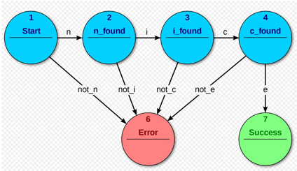

识别器

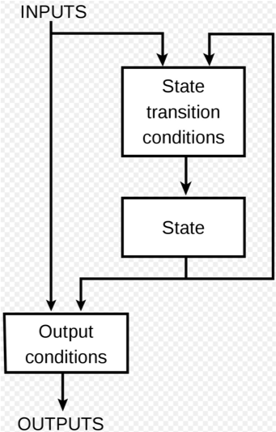

## Actor的作用

- 向其他Actor发送一定数量的消息
- 创建一定数量的新Actor对象（子Actor）
- 设定对下一条消息做出的回应方式
- Actor一般遵守面向对象的单一职责原则（Actor对象的粒度）

## Akka Actor的特点

- 位置透明性 通过抽象引用表示对象的地址，屏蔽本地与远程Actor系统细节
- 监督 在Actor对象之间建立上下级的关系
- Future/Promise对象 支持异步或阻塞接收操作结果
- Akka Actor模型与对象性能模型 
 
## 获得Actor引用途径

- 初始情况
- 父子关系
- 介绍关系 
- 赠与关系
 
ActorSelection与对象性能模型，是不兼容的

介绍关系

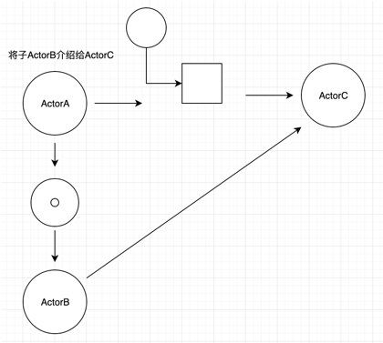

父子关系

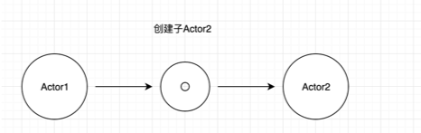

# Akka Actor 基本使用

## 创建和初始化

- 扩展Actor特质并实现receive方法接收消息（一般而言，不考虑Typed和Java API）
- 使用ActorSystem创建的是用户应用程序的顶级actor对象，每个应用只能创建一个
- 使用Actor的上下文创建的是一个子Actor，如：val child = context.actorOf(Props[MyActor], name = "myChild")
- Actor构造函数是值类型时需要手动拆包，或者手动调用Actor的构造函数
- Actor生命周期中的其他方法/属性：preStart、postStop、preRestart、postRestart、 unhandled 、supervisorStrategy、context

示例：实现一个Actor

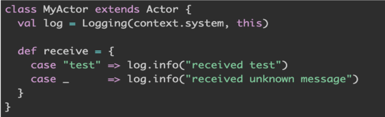

消息发送
 - ! 意思是“触发和遗忘”，例如异步发送消息并立即返回。又称tell
 - ? 异步发送消息并返回Future代表可能的答复。又称ask，底层依赖tell
 - tell发送消息：sender() ! x
示例：ask发送消息，并获得返回结果：

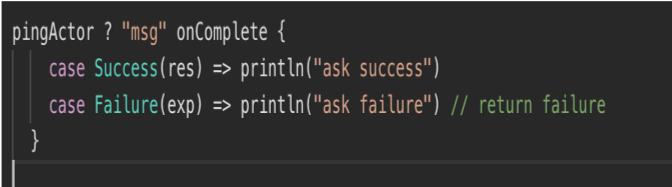

ask模式实现：

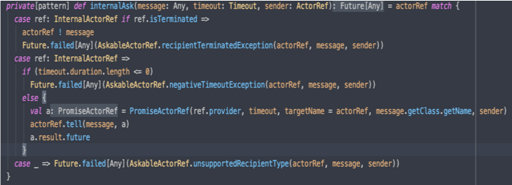

通过隐式参数构造AskableActorRef对象，
并调用tell填充promise，返回promise.future

## 异常处理

对各组件的影响：
- 消息 - 如果在处理消息时抛出异常，则此消息将丢失
- 信箱 - 处理消息时引发异常，则信箱不会发生任何情况。如果重新启动该Actor，则将存在相同的信箱
- Actor - Actor中的代码抛出异常，则暂停该Actor并启动监督处理，监督策略取决于上级Actor

示例：重写监督策略属性

四种处理策略：
- Resume 重启，保留状态  
- Restart 重启，清除状态
- Stop 停止Actor
- Escalate 上升/提升

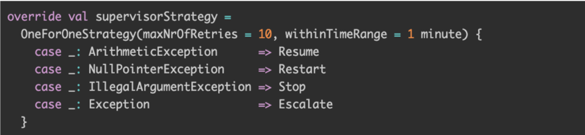

## 停止和终止

停止/终止分类：
- stop - 异步停止、成功后调用postStop、当前正在处理的消息继续、后续消息为死信
- Graceful Stop – 优雅停止、成功后调用postStop
- Poisonpill message – 作为普通消息排队、处理本消息时停止、watch
- Kill message - 杀死Actor、watch、ActorKilledException
- Coordinated Shutdown - 特定顺序停止、配置、DAG排序、注册任务

示例：注册关闭任务

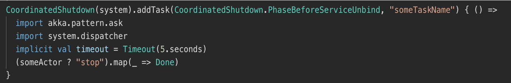

## 消息转变

become的主要用途：
- 运行时热交换消息遍历实现
- 替换当前行为（位于栈顶的）

示例：转变Receive（改变Actor的行为）
   
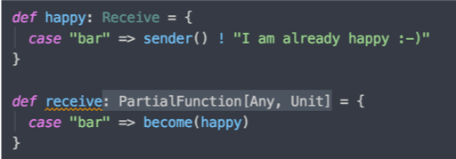

示例：推到栈顶
   

discardOld=true时表示替换当前行为

## 消息储藏

- 使用：混入Stash特质、需要基于deque的信箱
- 主要用途：当前行为无法或不能处理消息
- 表现的状态：可以恢复到信箱，并且处理顺序与接收相同

示例：储藏暂时不需处理的消息

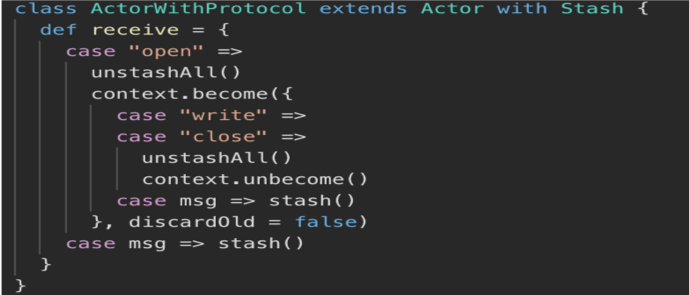

收到消息时先储藏，等待收到open消息时再取出所有消息进行处理，类似Git的 git stash和git stash apply命令。由于
消息接收模式变了，所以需要become/unbecome，Stash本质是存到scala.collection.immutable.Vector[Envelope]中.
unStallAll使用了反转，最先Stash的会最快出来并进入邮箱，所以邮箱需要是双端队列实现的

## 拓展Actor

- 使用：混入PartialFunction特质
- 主要用途：共享共同的行为或从多个较小的功能组成一个Actor的行为
- Actor.Receive就是PartialFunction[Any,Unit]的别名，允许使用orElse链接任意个数

示例：共享生产者与消费者的处理行为

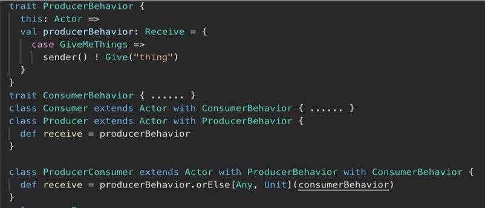

1. 生产者有自己的拓展的行为
2. 消费者也有自己的拓展的行为
3. 若当前对象需要同时拥有前两者的行为，
混入拓展Actor进行链式调用即可，而不需复制代码两份代码

# 消息传递的可靠性讨论

## 一般性规则

### 消息发送的规则

- 最多一次发送，即没有保证发送
- 每个（发送方 - 接收方）对是经排序的

这里的排序是指：Actor1发送A，B消息给Actor2，则接收方一定是先收到A消息的，然后是B。当然这不包括与第三方Actor的通信。
同时，也不包含使用优先级邮箱时的Actor。

* 为什么没有保证发送？
* 消息排序是什么？
* 失败的通信怎么处理？

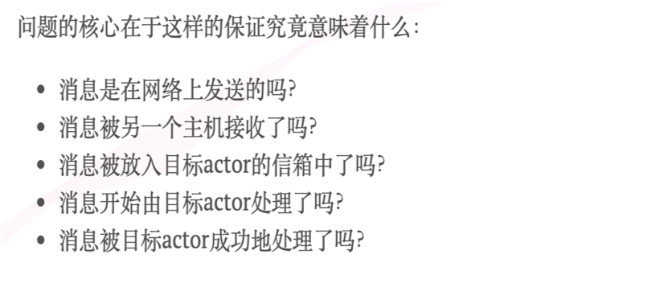

### 本地消息的发送规则

会使得应用程序只能在本地部署，不考虑。

### 更高层次的抽象

Akka Persistence 模块

# 远程交互

## 额外的模块支持（Akka remote）

使用方法：配置文件application.conf 如下图：远程Actor的配置

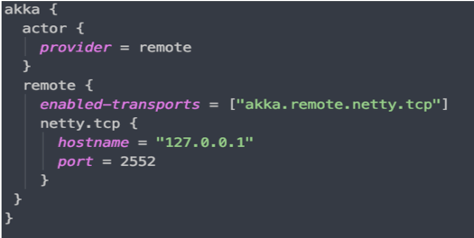

上述分别配置了下面内容：
- actor类型是远程的
- 主机地址和端口（Actor System域内唯一）
- 协议是netty tcp

特点：
- P2P通信，而不是C/S
- 支持使用ActorSelection查找远程Actor
- 支持直接创建Actor，如下图：Actor部署配置

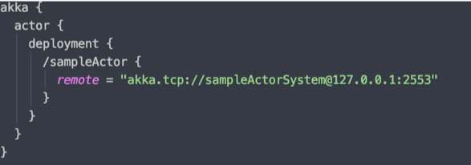

像创建本地Actor一样，使用Props创建一个actorRef，这里实际是告诉远程系统实例化该Actor而不是自己创建。

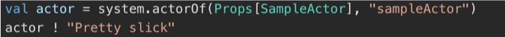

新的远程实现基于Aeron（UDP）和Akka Streams TCP/TLS而不是Netty TCP。

# 监督与监控

## 什么是监督

- 上级看管下级，下级为上级效力
- 上级对下级的失败作出反应
- 下级监测到故障时挂起自己和自己的下级，并向上级报告

如下图：

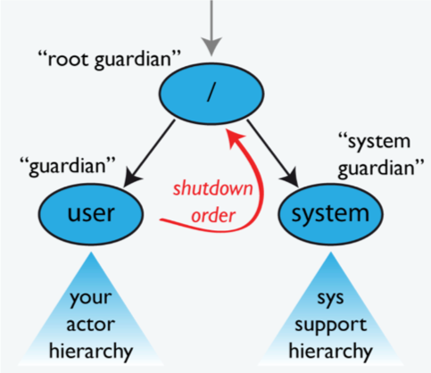

## 用于监督的高级别Actor

- / 所有Actor的监护者，非真正意义上的Actor
- /user 用户创建的Actor系统的顶级监护者，使用ActorSystem.actorOf获取 
- /system 所有系统创建的顶级Actor的监护者，为了实现有序的关闭序列 
- /deadLetters 死信Actor，发送失败的消息被路由到这
- /temp 短暂的系统创建的Actor的监护人
- /remote 人为的路径,下面是所有远程Actor引用

## 监督策略

- OneForOneStrategy 只对失败的Actor应用获得的指令
- AllForOneStrategy 对所有同级（层）Actor应用获得的指令
- 支持通过接收指定的异常，并应用指定的指令。
- 支持限制在终止前允许子Actor的程序的失败频率

## 失败的原因

- 收到的特定消息的系统错误（即编程错误）
- 处理消息期间使用的某些外部资源（暂时）失败
- Actor的内部状态已损坏

## 重新启动

1. 暂停Actor（这意味着它将在恢复之前不会处理正常消息），并递归地暂停所有子级
2. 调用旧实例的preRestart钩子（默认为向所有子Actor发送终止请求并调用postStop）
3. 等待在preRestart期间被请求终止的所有子Actor实际被终止（使用context.stop()；这是异步的，最后一个被杀死的孩子的终止通知将影响下一步的执行
4. 通过再次调用最初提供的工厂来创建新的Actor实例
5. 在新实例上调用postRestart（默认情况下也调用preStart）
6. 向所有未在步骤3中杀死的孩子发送重启请求；重新启动的孩子将从第2步开始递归地执行相同的过程
7. 恢复Actor

## 监控与监督比较

- 监控（watch）主要用于监视任意Actor的死亡以便作出应对。
- 监督（supervision）用于上级负责当子Actor出现异常后作出正确的的恢复操作

# 其他组件

相关模块

- HTTP
- Remote
- Persistence
- Streams
- Typed
- Cluster
- Distributed Data
- 其他 

# 参考资料

网站：

* Akka 官方文档 https://doc.akka.io/docs/akka/current/index-actors.html
* 有限状态机 https://zh.wikipedia.org/wiki/%E6%9C%89%E9%99%90%E7%8A%B6%E6%80%81%E6%9C%BA

书籍：

* 《响应式架构 消息模式Actor实现与Scala、Akka应用集成》
