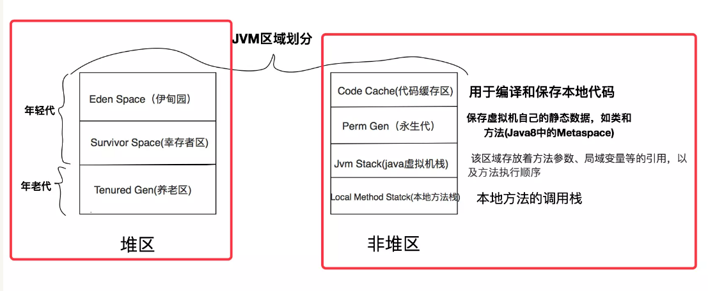
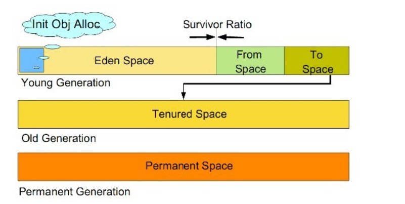

* 目录
{:toc}

## JVM 的主要组成部分及其作用

JVM包含两个子系统和两个组件，两个子系统为Class loader（类加载）、Execution engine（执行引擎）；两个组件为 Runtime data area（运行时数据区）、Native Interface（本地接口）。

- Class loader（类加载）：根据给定的全限定名类名（如：java.lang.Object）来装载 class 文件到 Runtime data area 中的 method area。
- Execution engine（执行引擎）：执行 classes 中的指令。
- Native Interface（本地接口）：与 native libraries 交互，是其它编程语言交互的接口。
- Runtime data area（运行时数据区域）：这就是我们常说的 JVM 的内存。

作用 ：首先通过类加载器（ClassLoader）会把 Java 代码转换成字节码，运行时数据区（Runtime Data Area）再把字节码加载到内存中，
而字节码文件只是 JVM 的一套指令集规范，并不能直接交给底层操作系统去执行，因此需要特定的命令解析器执行引擎（Execution Engine），
将字节码翻译成底层系统指令，再交由 CPU 去执行，而这个过程中需要调用其他语言的本地库接口（Native Interface）来实现整个程序的功能。

## 深拷贝和浅拷贝

- 浅拷贝（shallowCopy）只是增加了一个指针指向已存在的内存地址，
- 深拷贝（deepCopy）是增加了一个指针并且申请了一个新的内存，使这个增加的指针指向这个新的内存，

使用深拷贝的情况下，释放内存的时候不会因为出现浅拷贝时释放同一个内存的错误。这里的释放错误主要针对 C/C++ 等，而在 Java 中主要体现在，修改浅拷贝的对象会修改到原对象，此时若不想修改原对象应该使用深拷贝，但应考虑性能和序列化问题。

## 处理并发安全问题

对象的创建在虚拟机中是一个非常频繁的行为，哪怕只是修改一个指针所指向的位置，在并发情况下也是不安全的，可能出现正在给对象 A 分配内存，指针还没来得及修改，对象 B 又同时使用了原来的指针来分配内存的情况。解决这个问题有两种方案

- 对分配内存空间的动作进行同步处理（采用 CAS + 失败重试来保障更新操作的原子性）；
- 把内存分配的动作按照线程划分在不同的空间之中进行，即每个线程在 Java 堆中预先分配一小块内存，称为本地线程分配缓冲（Thread Local Allocation Buffer, TLAB）。
哪个线程要分配内存，就在哪个线程的 TLAB 上分配。只有 TLAB 用完并分配新的 TLAB 时，才需要同步锁。通过 -XX:+/-UserTLAB 参数来设定虚拟机是否使用 TLAB 。

## 对象的访问定位

Java 程序需要通过 JVM 栈上的引用访问堆中的具体对象。对象的访问方式取决于 JVM 虚拟机的实现。目前主流的访问方式有 句柄 和 直接指针 两种方式。

- 指针： 指向对象，代表一个对象在内存中的起始地址。

优势：速度更快，节省了一次指针定位的时间开销。由于对象的访问在 Java 中非常频繁，因此这类开销积少成多后也是非常可观的执行成本。HotSpot 中采用的就是这种方式。

- 句柄： 可以理解为指向指针的指针，维护着对象的指针。句柄不直接指向对象，而是指向对象的指针（句柄不发生变化，指向固定内存地址），再由对象的指针指向对象的真实内存地址。

优势：引用中存储的是稳定的句柄地址，在对象被移动（垃圾收集时移动对象是非常普遍的行为）时只会改变句柄中的实例数据指针，而引用本身不需要修改。
如果使用直接指针访问（也就是指针），引用中存储的直接就是对象地址，那么 Java 堆对象内部的布局中就必须考虑如何放置访问类型数据的相关信息。

## 为对象分配内存

类加载完成后，接着会在Java堆中划分一块内存分配给对象。内存分配根据Java堆是否规整，有两种方式

- 指针碰撞：如果 Java 堆的内存是规整，即所有用过的内存放在一边，而空闲的的放在另一边。分配内存时将位于中间的指针指示器向空闲的内存移动一段与对象大小相等的距离，这样便完成分配内存工作。
- 空闲列表：如果 Java 堆的内存不是规整的，则需要由虚拟机维护一个列表来记录那些内存是可用的，这样在分配的时候可以从列表中查询到足够大的内存分配给对象，并在分配后更新列表记录。

选择哪种分配方式是由 Java 堆是否规整来决定的，而 Java 堆是否规整又由所采用的垃圾收集器是否带有压缩整理功能决定。

## JVM 中的内存区域划分

[JVM规范](https://docs.oracle.com/javase/specs/jvms/se9/html/jvms-2.html#jvms-2.5)

### 程序计数器（PC，Program Counter Register）

在 JVM 规范中，每个线程都有它自己的程序计数器，并且任何时间一个线程都只有一个方法在执行，也就是所谓的当前方法。
程序计数器会存储当前线程正在执行的 Java 方法的 JVM 指令地址；或者，如果是在执行本地方法，则是未指定值（undefined）。

### Java 虚拟机栈（Java Virtual Machine Stack）

早期也叫 Java 栈。每个线程在创建时都会创建一个虚拟机栈，其内部保存一个个的栈帧（Stack Frame），对应着一次次的 Java 方法调用。
前面谈程序计数器时，提到了当前方法；同理，在一个时间点，对应的只会有一个活动的栈帧， 通常叫作当前帧（方法栈最顶层的那个），方法所在的类叫作当前类。
如果在该方法中调用了其他方法，对应的新的栈帧会被创建出来，成为新的当前帧，一直到它返回结果或者执行结束。JVM 直接对 Java 栈的操作只有两个，就是对栈帧的压栈和出栈。
栈帧中存储着局部变量表、操作数（operand）栈、动态链接、方法正常退出或者异常退出的定义等。

### 堆（Heap）

它是 Java 内存管理的核心区域，用来放置 Java 对象实例，几乎所有创建的 Java 对象实例都是被直接分配在堆上。因为标量替换和栈上分配技术的出现，使得对象在栈上也成为可能。
堆被所有的线程共享，在虚拟机启动时，我们指定 的 “Xmx” 之类参数就是用来指定最大堆空间等指标。
理所当然，堆也是垃圾收集器重点照顾的区域，所以堆内空间还会被不同的垃圾收集器进行进一步的细分，最有名的就是新生代、老年代的划分（Java 8）。

### 方法区（Method Area）

这也是所有线程共享的一块内存区域，用于存储所谓的元数据（Meta Data），例如类结构信息，以及对应的运行时常量池、字段、方法代码等。
由于早期的 Hotspot JVM 实现，很多人习惯于将方法区称为永久代（Permanent Generation），Oracle JDK 8 中将永久代移除，同时增加了元数据区（Metaspace）。

### 运行时常量池（Run-Time Constant Pool）

这是方法区的一部分。如果仔细分析过反编译的类文件结构，你能看到版本号、字段、方法、超类、接口等各种信息，还有一项信息就是常量池。
Java 的常量池可以存放各种常量信息，不管是编译期生成的各种字面量，还是需要在运行时决定的符号引用，所以它比一般语言的符号表存储的信息更加丰富。

### 本地方法栈（Native Method Stack）

它和 Java 虚拟机栈是非常相似的，支持对本地方法的调用，也是每个线程都会创建一个。
在 Oracle Hotspot JVM 中，本地方法栈和 Java 虚拟机栈是在同一块儿区域，这完全取决于技术实现的决定，并未在虚拟机规范中强制要求。
上面各个区域的之间的关系，就可以使用下面的图来进行。



## 引用计数法与可达性分析

垃圾回收，顾名思义，便是将已经分配出去的，但却不再使用的内存回收回来，以便能够再次分配。
在 Java 虚拟机的语境下，垃圾指的是死亡的对象所占据的堆空间。这里便涉及了一个关键的问题：如何辨别一个对象是存是亡？
我们先来讲一种古老的辨别方法：引用计数法（reference counting）。它的做法是为每个对象添加一个引用计数器，用来统计指向该对象的引用个数。
一旦某个对象的引用计数器为 0，则说 明该对象已经死亡，便可以被回收了。
它的具体实现是这样子的：如果有一个引用，被赋值为某一对象，那么将该对象的引用计数器 +1。如果一个指向某一对象的引用，被赋值为其他值，那么将该对象的引用计数器 -1。
也就是说，我们需要截获所有的引用更新操作，并且相应地增减目标对象的引用计数器。
举个例子，假设对象 a 与 b 相互引用，除此之外没有其他引用指向 a 或者 b。
在这种情况下，a 和 b 实际上已经死了，但由于它们的引用计数器皆不为 0，在引用计数法的心中，这两个对象还活着。
因此，这些循环引用对象所占据的空间将不可回收，从而造成了内存泄露。这在《深入理解Java虚拟机》中有详细介绍。

目前 Java 虚拟机的主流垃圾回收器采取的是可达性分析算法。
这个算法的实质在于将一系列 GC Roots 作为初始的存活对象合集（live set），然后从该合集出发，探索所有能够被该集合引用到的对象，并将其加入到该集合中，
这个过程我们也称之为标记（mark）。最终，未被探索到的对象便是死亡的，是可以回收的。
那么什么是 GC Roots 呢？我们可以暂时理解为由堆外指向堆内的引用，一般而言，GC Roots 包括（但不限于）如下几种：

* Java 方法栈桢中的局部变量引用的对象
* 已加载类的静态变量引用的对象
* JNI handles
* 已启动且未停止的 Java 线程
* 方法区中常量引用的对象

可达性分析可以解决引用计数法所不能解决的循环引用问题。举例来说，即便对象 a 和 b 相互 引用，只要从 GC Roots 出发无法到达 a 或者 b，
那么可达性分析便不会将它们加入存活对象合集之中。
虽然可达性分析的算法本身很简明，但是在实践中还是有不少其他问题需要解决的。
比如说，在多线程环境下，其他线程可能会更新已经访问过的对象中的引用，从而造成误报（将引用设置为 null）或者漏报（将引用设置为未被访问过的对象）。
误报并没有什么伤害，Java 虚拟机至多损失了部分垃圾回收的机会。漏报则比较麻烦，因为垃圾回收器可能回收事实上仍被引用的对象内存。
一旦从原引用访问已经被回收了的对象，则很有可能会直接导致 Java 虚拟机崩溃。

### Stop-the-world 以及安全点

怎么解决这个问题呢？在 Java 虚拟机里，传统的垃圾回收算法采用的是一种简单粗暴的方式，
那便是 Stop-the-world，停止其他非垃圾回收线程的工作，直到完成垃圾回收。这也就造成了垃圾回收所谓的暂停时间（GC pause）。
Java 虚拟机中的 Stop-the-world 是通过安全点（safepoint）机制来实现的。
当 Java 虚拟机收到 Stop-the-world 请求，它便会等待所有的线程都到达安全点，才允许请求 Stop-the-world 的线程进行独占的工作。
当然，安全点的初始目的并不是让其他线程停下，而是找到一个稳定的执行状态。
在这个执行状态下，Java 虚拟机的堆栈不会发生变化。这么一来，垃圾回收器便能够“安全”地执行可达性分析。

## 垃圾回收的三种方式

当标记完所有的存活对象时，我们便可以进行死亡对象的回收工作了。主流的基础回收方式可分为三种。

标记-清除算法 将垃圾回收分为两个阶段：标记阶段和清除阶段。一种可行的实现是，在标记阶段首先通过根节点，标记所有从根节点开始的较大对象。
因此，未被标记的对象就是未被引用的垃圾对象。然后，在清除阶段，清除所有未被标记的对象。
该算法最大的问题是存在大量的空间碎片，因为回收后的空间是不连续的。在对象的堆空间分配过程中，尤其是大对象的内存分配，不连续的内存空间的工作效率要低于连续的空间。
从概念上来讲，标记-清除算法使用的方法是最简单的，只需要忽略这些对象便可以了。
也就是说当标记阶段完成之后，未被访问到的对象所在的空间都会被认为是空闲的，可以用来创建新的对象。
这种方法需要使用一个空闲列表来记录所有的空闲区域以及大小。对空闲列表的管理会增加分配对象时的工作量。
这种方法还有一个缺陷就是——虽然空闲区域的大小是足够的，但却可能没有一个单一区域能够满足这次分配所需的大小，因此本次分配还是会失败（在Java中就是一次 OutOfMemoryError）。

复制算法 将现有的内存空间分为两快，每次只使用其中一块，在垃圾回收时将正在使用的内存中的存活对象复制到未被使用的内存块中，之后，清除正在使用的内存块中的所有对象，
交换两个内存的角色，完成垃圾回收。如果系统中的垃圾对象很多，复制算法需要复制的存活对象数量并不会太大。因此在真正需要垃圾回收的时刻，复制算法的效率是很高的。
又由于对象在垃圾回收过程中统一被复制到新的内存空间中，因此，可确保回收后的内存空间是没有碎片的。该算法的缺点是将系统内存折半（HotSot 默认的 eden:survivor = 8:1，也就是浪费10%内存）。
同时这种算法也存在巨大缺陷，假如每次可回收对象没有占到绝大多数（虽然一般绝大多数对象都是短命的），survivor 就不够用了并且复制的成本也会提高，所以还需要其他内存来担保。

标记-压缩算法 一种老年代的回收算法，它在标记-清除算法的基础上做了一些优化。
也首先需要从根节点开始对所有可达对象做一次标记，但之后，它并不简单地清理未标记的对象，而是将所有的存活对象压缩到内存的一端。
之后，清理边界外所有的空间。这种方法既避免了碎片的产生，又不需要两块相同的内存空间，因此，其性价比比较高。

标记-压缩算法修复了标记-清除算法的短板——它将所有标记的也就是存活的对象都移动到内存区域的开始位置。
这种方法的缺点就是 GC 暂停的时间会增长，因为你需要将所有的对象都拷贝到一个新的地方，还得更新它们的引用地址。
相对于标记-清除算法，它的优点也是显而易见的——经过整理之后，新对象的分配只需要通过指针碰撞（pointer bumping）便能完成，相当简单。
使用这种方法空闲区域的位置是始终可知的，也不会再有碎片的问题了。

现代的垃圾回收器往往会综合上述几种回收方式，综合它们优点的同时规避它们的缺点。

## Java 常见的垃圾收集器有哪些？

实际上，垃圾收集器（GC，Garbage Collector）是和具体 JVM 实现紧密相关的，不同厂商 （IBM、Oracle），不同版本的 JVM，提供的选择也不同。
一般我们说的 JVM 指的就是 Oracle JDK 的 JVM。

### Serial GC

它是最古老的垃圾收集器，“Serial”体现在其收集工作是单线程的，并且在进行垃圾收集过程中，会进入臭名昭著的“Stop-The-World”状态。
当然，其单线程设计也意味着精简的 GC 实现，无需维护复杂的数据结构，初始化也简单，所以一直是 Client 模式 下 JVM 的默认选项。
从年代的角度，通常将其老年代实现单独称作 Serial Old，它采用了标记 - 整理（Mark-Compact）算法，区别于新生代的复制算法。

Serial GC 对应 JVM 参数是：-XX:+UseSerialGC

### ParNew GC

很明显是个新生代 GC 实现，它实际是 Serial GC 的多线程版本，最常见的应用场景是配合老年代的 CMS GC 工作。

ParNew GC 对应 JVM 参数是：-XX:+UseConcMarkSweepGC -XX:+UseParNewGC

###  CMS（Concurrent Mark Sweep） GC

基于标记-清除（Mark-Sweep）算法，设计目标是尽量减少停顿时间，这一点对于 Web 等反应时间敏感的应用非常重要，一直到今天，仍然有很多系统使用 CMS GC。
但是，CMS 采用的标记-清除算法，存在着内存碎片化问题，所以难以避免在长时间运行等情况下发生 full GC，导致恶劣的停顿。
另外，既然强调了 并发（Concurrent），CMS 会占用更多 CPU 资源，并和用户线程争抢。

CMS GC对应 JVM 参数是：-XX:+UseConcMarkSweepGC，年轻代自动开启 -XX:-UseParNewGC

### Parallel GC

在早期 JDK 8 等版本中，它是 server 模式 JVM 的默认 GC 选择，也被称作是吞吐量优先的 GC。它的算法和 Serial GC 比较相似，尽管实现要复杂的多，
其特点是新生代和老年代 GC 都是并行进行的，在常见的服务器环境中更加高效。

Parallel GC 对应 JVM 参数是：-XX:+UseParallelGC

另外，Parallel GC 引入了开发者友好的配置项，我们可以直接设置暂停时间或吞吐量等目标， JVM 会自动进行适应性调整，例如下面参数：

-XX:MaxGCPauseMillis=value
-XX:GCTimeRatio=N // GC 时间和用户时间比例 = 1 / （N+1）

### G1 GC

这是一种兼顾吞吐量和停顿时间的 GC 实现，是 Oracle JDK 9 以后的默认 GC 选项。
G1 可以直观的设定停顿时间的目标，相比于 CMS GC，G1 未必能做到 CMS 在最好情况下的延时停顿，但是最差情况要好很多。
G1 GC 仍然存在着年代的概念，但是其内存结构并不是简单的条带式划分，而是类似棋盘的 一个个 region。Region 之间是复制算法，
但整体上实际可看作是标记-整理（Mark- Compact）算法，可以有效地避免内存碎片，尤其是当 Java 堆非常大的时候，G1 的优势更加明显。
G1 吞吐量和停顿表现都非常不错，并且仍然在不断地完善，与此同时 CMS 已经在 JDK 9 中 被标记为废弃（deprecated），所以 G1 GC 值得你深入掌握。
上面介绍了GC的分析，接下来就来看下JVM堆内存是如何进行分配和回收的。

## 垃圾回收过程的理解

在垃圾收集的过程，对应到 Eden、 Survivor、Tenured 等区域会发生什么变化呢？实际上取决于具体的 GC 方式，先来熟悉一下通常的垃圾收集流程.

第一，Java 应用不断创建对象，通常都是分配在 Eden 区域，当其空间占用达到一定阈值时， 触发 minor GC。
仍然被引用的对象存活下来，被复制到 JVM 选择的 Survivor 区 域，而没有被引用的对象则被回收。



第二， 经过一次 Minor GC，Eden 就会空闲下来，直到再次达到 Minor GC 触发条件，这时候，另外一个 Survivor 区域则会成为 to 区域，Eden 区域的存活对象和 From 区域对象，
都会 被复制到 to 区域，并且存活的年龄计数会被加 1。

第三， 类似第二步的过程会发生很多次，直到有对象年龄计数达到阈值，这时候就会发生所谓的晋升（Promotion）过程，超过阈值的对象会被晋升到老年代。
这个阈值是可以通过参数指定:-XX:MaxTenuringThreshold=<N>

后面就是老年代 GC，具体取决于选择的 GC 选项，对应不同的算法。老年代中的无用对象被清除后， GC 会将对象进行整理，以防止内存碎片化。

通常我们把老年代 GC 叫作 Major GC，将对整个堆进行的清理叫作 full GC，但是这个也没有那么绝对，因为不同的老年代 GC 算法其实表现差异很大，
例如 CMS，“concurrent”就体现在清理工作是与工作线程一起并发运行的。

JVM 的可配置参数列表[jvm vmoptions](https://www.oracle.com/technetwork/articles/java/vmoptions-jsp-140102.html)

## 问题

* 什么是本地方法JNI ？

比如我们希望使用汇编语言 （如 X86_64 的 SIMD 指令）来提升关键代码的性能；
再比如，我们希望调用 Java 核心类库无 法提供的，某个体系架构或者操作系统特有的功能。
在这种情况下，我们往往会牺牲可移植性，在 Java 代码中调用 C/C++ 代码（下面简述为 C 代 码），
并在其中实现所需功能。这种跨语言的调用，便需要借助 Java 虚拟机的 Java Native Interface（JNI）机制。 关于 JNI 的例子，
你应该特别熟悉 Java 中标记为 native 的、没有方法体的方法（下面统称为 native 方法）。
当在 Java 代码中调用这些 native 方法时，Java 虚拟机将通过 JNI，调用至对应的 C 函数（下面将 native 方法对应的 C 实现统称为 C 函数）中。
例如下面的方法，使用native方法定义的方法。
```java
public class Object {
  public native int hashCode();
}
```

* 为什么第二次GC 的时候，eden 的的对象为什么会被直接复制到s2？

第一次 从 eden 复制到 s1 。
当eden区的内存再次被使用完时，会触发第二次minor gc，将eden区和S1区中存活的对象拷贝到S2区，并将eden区和S1区的内存清空以备使用。
复制的过程 引用计数会增加
当eden区的内存再次被用完时，会触发第三次minor gc，将eden区和S2区存活的对象拷贝到S1区，并清空eden区和S2区的内存，以备使用。
当引用计数达到一定程度时，就会被复制到老年代。老年代没有内存的时候也会触发GC，以此往复。

* 堆与栈的具体区别是什么？

	1. 堆和栈之间的主要区别在于栈内存用于存储局部变量和函数调用，而堆内存用于在 Java 中存储对象（不考虑标量替换、栈上分配）。无论在何处，对象是在代码中创建的，例如作为成员变量，局部变量或类变量，它们总是在 Java 中的堆空间内创建。
	2. Java中的每个线程都有自己的堆栈，可以使用 -Xss JVM 参数指定，类似地，也可以使用 JVM 选项 -Xms 和 -Xmx 指定 Java 程序的堆大小，其中 -Xms 是堆的起始大小和 -Xmx 是 Java 堆的最大大小。
	3. 如果栈中没有用于存储函数调用或局部变量的内存，JVM 将抛出java.lang.StackOverFlowError，而如果没有更多的堆空间用于创建对象，JVM将抛出java.lang.OutOfMemoryError；
	4. 如果正在使用递归，在那个方法调用自己，你可以快速填充栈内存。堆栈和堆之间的另一个区别是栈内存的大小比 Java 中的堆内存大小要小得多。
	
* GC复制存活的对象，内存地址会变吗？以前的引用怎么办？

这里 stackoverflow 上的一个 question 获取能够解答这个疑问。
[After GC , the address of the object in memory be changed and why the object reference still valid？](https://stackoverflow.com/questions/15218438/after-gc-the-address-of-the-object-in-memory-be-changed-and-why-the-object-ref)
gc 复制存活的对象，其原来的地址会发生变化。不过这些 jvm 就帮我们处理好了，对于程序员来说，这些是无感知的。

* Java 中都有哪些引用类型？

1. 强引用：发生 gc 的时候不会被回收。
2. 软引用：有用但不是必须的对象，在发生内存溢出之前会被回收。
3. 弱引用：有用但不是必须的对象，在下一次GC时会被回收。
4. 虚引用（幽灵引用/幻影引用）：无法通过虚引用获得对象，用 PhantomReference 实现虚引用，虚引用的用途是在 gc 时返回一个通知。

* 说一下类装载的执行过程？

1. 加载：根据查找路径找到相应的 class 文件然后导入；
2. 验证：检查加载的 class 文件的正确性；
3. 准备：给类中的静态变量分配内存空间；（final static 常量赋值，static 变量初始化为零值）
4. 解析：虚拟机将常量池中的符号引用替换成直接引用的过程。符号引用就理解为一个标识，而在直接引用直接指向内存中的地址；
5. 初始化：对静态变量和静态代码块执行初始化工作。

## 常用 JVM 参数

| 属性 | 备注 |
| :--- | :--- |
| -server |	C2引擎执行 |
| -Xms20g |	最小堆内存20G |
| -Xmx20g |	最大堆内存20G |
| -Xmn8g |	新生代8G |
| -XX:PermSize=256m | Perm大小256MB |
| -XX:MaxPermSize=256m | Perm大小256MB 8以后过期 |
| -XX:SurvivorRatio=10 | YoungGC 3个区的比例 |
| -XX:+UseConcMarkSweepGC |	Old区使用CMS GC |
| -XX:+UseCMSCompactAtFullCollection | 一旦触发FullGC对Old区进行压缩减少内存碎片 |
| -XX:CMSMaxAbortablePrecleanTime=5000 | CMS GC的回收超时时间，避免GC时间太久 |
| -XX:+CMSClassUnloadingEnabled | 支持CMS GC时对Perm区的Class和ClassLoader做GC，否则要等FullGC |
| -XX:CMSInitiatingOccupancyFraction=80 | Old区达到80%时触发CMS GC，如果不设置，JVM会自适应，效果不好 |
| -XX:+UseCMSInitiatingOccupancyOnly | 只以CMSInitiatingOccupancyFraction设定的阈值为准，不加这个参数CMSInitiatingOccupancyFraction会不生效 |
| -XX:+HeapDumpOnOutOfMemoryError |	OOM时自动jmap dump内存 |
| -XX:HeapDumpPath | OOM时dump内存的位置 |
| -Xloggc: | GC log位置 |
| -XX:+PrintGCDetails |	打印GC详细信息 |
| -XX:+PrintGCDateStamps | 将GC时间由时间戳改为人类可识别的时刻点 |
| -Dsun.net.client.defaultConnectTimeout=10000 | socket连接超时时间 |
| -Dsun.net.client.defaultReadTimeout=30000 | socket读超时时间 |
| -verbose:class | 打印类加载信息 |
| -XX:MaxDirectMemorySize=1g | 控制DirectByteBuffer占用的堆外内存大小，防止堆外内存导致OOM |
| -XX:+ExplicitGCInvokesConcurrent| 调用System.gc()时触发CMS GC而不是Full GC |
| -XX:ParallelGCThreads=${CPU_COUNT} | 并发GC线程数 Young GC |
| -Dfile.encoding=${JAVA_FILE_ENCODING} | 文件默认编码 |

参考资料

- [深入拆解JVM](https://time.geekbang.org/column/article/13091)
- [JVM 垃圾回收](https://blog.csdn.net/ChineseYoung/article/details/80488977)
- [垃圾收集器算法](https://segmentfault.com/a/1190000010463373)
- [内存划分](https://github.com/Snailclimb/JavaGuide/blob/master/docs/java/jvm/Java%E5%86%85%E5%AD%98%E5%8C%BA%E5%9F%9F.md)
- [JVM （Java Virtual Machine） Architecture](https://www.javatpoint.com/internal-details-of-jvm)
- [JVM的内存区域划分 + 垃圾回收机制](https://www.liangzl.com/get-article-detail-13008.html)
