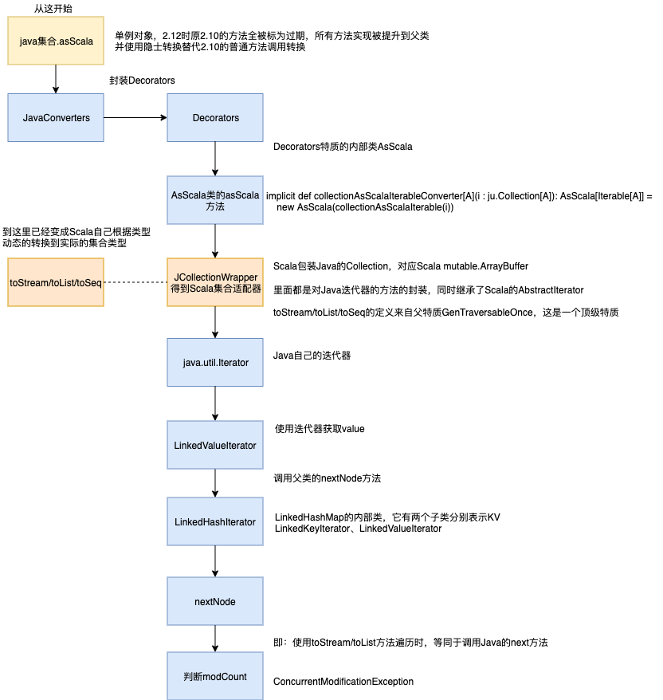

这里有两个需要小心的点。

```scala
import java.util
import scala.collection.JavaConverters._
/**
 * Java集合转换为Scala集合 使用JavaConverters的隐式方法，由父特质DecorateAsJava定义
 *
 * @author 梦境迷离
 * @since 2019-09-25
 * @version v1.0
 */
object JavaCollectionTest extends App {

  val javaMap = new util.LinkedHashMap[String, String]
  javaMap.put("1", "1")


  //本质是通过适配器使用迭代器遍历
  val scalaMap = javaMap.asScala.toMap //return Map(1 -> 1)
  //这里toSeq里面实际就是toStream，延迟求值可能会影响实时性业务
  val scalaStream = javaMap.values().asScala.toSeq //return Stream(1, ?)

  println(scalaMap)
  println(scalaStream)

}
```

任何迭代器需求注意的地方，调用`asScala.toSeq/toMap`都需要注意。特别是在并发情况下，若有线程在更新集合，此时调用`asScala.toSeq/toMap`的线程相当于在调用迭代器。
进而很可能发生`ConcurrentModificationException`异常。并且这个问题被隐藏的挺深，一不小心就不注意。若是直接使用`iterator`可能大家一眼就能想到是快速失败原理造成。
当然`ConcurrentModificationException`不只是出现在多线程环境下，单线程同样有这个问题。只不过一般使用`LinkedHashMap`实现LRU缓冲时，都是因为并发才做缓存使用（LinkedHashMap的构造函数accessOrder=true）。
因为这个问题最终还是迭代器的锅，所以在put时使用get（根据计算的hash获取而不是使用迭代器遍历）方法不会有这个问题，顶多就是get没找到，然后多存一份。这种情况就需要锁或其他同步处理LRU了。

下面这张图简单描述了asScala的调用流程：



