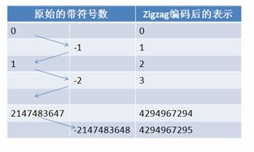

* 目录
{:toc}

# ProtoBuf的优点

ProtoBuf有如XML，不过它更小、更快、也更简单。你可以定义自己的数据结构，然后使用代码生成器生成的代码来读写这个数据结构。你甚至可以在无需重新部署程序的情况下更新数据结构。只需使用ProtoBuf对数据结构进行一次描述，即可利用各种不同语言或从各种不同数据流中对你的结构化数据轻松读写。

它有一个非常棒的特性，即“向后”兼容性好，人们不必破坏已部署的、依靠“老”数据格式的程序就可以对数据结构进行升级。这样你的程序就可以不必担心因为消息结构的改变而造成的大规模的代码重构或者迁移的问题。因为添加新的消息中的Field并不会引起已经发布的程序的任何改变。

ProtoBuf语义更清晰，无需类似XML解析器的东西（因为ProtoBuf编译器会将`.proto`文件编译生成对应的数据访问类以对ProtoBuf数据进行序列化、反序列化操作）。

使用ProtoBuf无需学习复杂的文档对象模型，ProtoBuf的编程模式比较友好，简单易学，同时它拥有良好的文档和示例，对于喜欢简单事物的人们而言，ProtoBuf比其他的技术更加有吸引力。

对于使用GraphQL构建的Web服务，甚至可以将ProtoBuf生成的DTO直接映射到GraphQL type。

# ProtoBuf的不足

ProtoBuf与XML相比也有不足之处。它功能简单，无法用来表示复杂的概念。

XML已经成为多种行业标准的编写工具，ProtoBuf只是Google公司内部使用的工具，在通用性上还差很多。对于微服务来说，使用gRPC的话需要依赖pb的客户端。

由于文本并不适合用来描述数据结构，所以ProtoBuf也不适合用来对基于文本的标记文档（如HTML）建模。
另外，由于XML具有某种程度上的自解释性，它可以被人直接读取编辑，在这一点上ProtoBuf不行，它以二进制的方式存储，除非你有`.proto`定义，否则你没法直接读出ProtoBuf的任何内容。

# ProtoBuf更多细节

人们一直在强调，同XML相比，ProtoBuf的主要优点在于性能高。它以高效的二进制方式存储，比XML小3到10倍，快20到100倍。

对于这些“小3到10倍”，“快20到100倍”的说法，严肃的程序员需要一个解释。因此在本文的最后，让我们稍微深入ProtoBuf的内部实现吧。

有两项技术保证了采用ProtoBuf的程序能获得相对于XML极大的性能提高。

第一点，我们可以考察ProtoBuf序列化后的信息内容。你可以看到Protocol Buffer信息的表示非常紧凑，这意味着消息的体积减少，自然需要更少的资源。比如网络上传输的字节数更少，需要的IO更少等，从而提高性能。

第二点我们需要理解ProtoBuf封解包的大致过程，从而理解为什么会比XML快很多。

## ProtoBuf编码

ProtoBuf序列化后所生成的二进制消息非常紧凑，这得益于ProtoBuf采用的非常巧妙的Encoding方法。

考察消息结构之前，让我首先要介绍一个叫做Varint的术语。

Varint是一种紧凑的表示数字的方法。它用一个或多个字节来表示一个数字，值越小的数字使用越少的字节数。这能减少用来表示数字的字节数。

比如对于`int32`类型的数字，一般需要4个byte来表示。但是采用Varint，对于很小的`int32`类型的数字，则可以用1个byte来表示。当然凡事都有好的也有不好的一面，采用Varint表示法，大的数字则需要5个byte来表示（`5 * 8 - 5 > 32`）。从统计的角度来说，一般不会所有的消息中的数字都是大数，因此大多数情况下，采用Varint后，可以用更少的字节数来表示数字信息。下面就详细介绍一下Varint。

Varint中的每个byte的最高位bit有特殊的含义，如果该位为1，表示后续的byte也是该数字的一部分，如果该位为0，则结束。其他的7个bit都用来表示数字。因此小于128的数字都可以用一个byte表示。大于128的数字，比如300，会用两个字节来表示：`1010 1100 0000 0010`。
如果按照正常的二进制计算的话，这个表示的是 88068（65536 + 16384 + 4096 + 2048 + 4）。显然，ProtoBuf不是按照这种简单方式来编码的。

下图演示了Google Protocol Buffer如何解析两个bytes。注意到最终计算前将两个byte的位置相互交换过一次，这是因为Google Protocol Buffer字节序采用little-endian（即低位字节排放在内存的低地址端，高位字节排放在内存的高地址端）的方式。

Varint 编码：


消息经过序列化后会成为一个二进制数据流，该流中的数据为一系列的Key-Value对。如下图所示：


采用这种Key-Pair结构无需使用分隔符来分割不同的Field。对于可选的Field，如果消息中不存在该Field，那么在最终的Message Buffer中就没有该Field，这些特性都有助于节约消息本身的大小。

假设我们生成如下的一个`helloworld`类型的消息（Java中一般使用DTO和builder构建对象）：
```
helloworld.id = 101; 
helloworld.name = "hello";
```

则最终的Message Buffer中有两个Key-Value对，一个对应消息中的id；另一个对应name。Key用来标识具体的Field，在解包的时候，Protocol Buffer根据Key就可以知道相应的Value应该对应于消息中的哪一个Field。

Key 的定义如下：
```
(field_number << 3) | wire_type
```

可以看到Key由两部分组成。第一部分是field_number，表示字段编号。第二部分为wire_type，表示Value的传输类型。Wire Type可能的类型如下表所示：

| Type | Meaning       | Used For                                                 |
| ---- | ------------- | -------------------------------------------------------- |
| 0    | Varint        | int32, int64, uint32, uint64, sint32, sint64, bool, enum |
| 1    | 64-bit        | fixed64, sfixed64, double                                |
| 2    | Length-delimi | string, bytes, embedded messages, packed repeated fields |
| 3    | Start         | group	Groups (deprecated)                                |
| 4    | End           | group	Groups (deprecated)                                |
| 5    | 32-bit        | fixed32, sfixed32, float                                 |

假如我们有`.proto`文件：
```proto
message helloworld 
{ 
   required int32     id = 1;  // id
   required string    name = 2;  // name 
   optional int32     opt = 3;  //optional field 
}
```

`id`所采用的数据类型为`int32`，因此对应的wire_type为0。细心的读者或许会看到在Type 0所能表示的数据类型中有`int32`和`sint32`这两个非常类似的数据类型。Google Protocol Buffer区别它们的主要意图也是为了减少Encoding后的字节数。

在计算机内，一个负数一般会被表示为一个很大的整数，因为计算机定义负数的符号位为数字的最高位。如果采用Varint表示一个负数，那么一定需要5个byte。为此 Google Protocol Buffer定义了`sint32`这种类型，采用zigzag编码。

zigzag编码用无符号数来表示有符号数字，正数和负数交错，这就是zigzag这个词的含义了。

如图所示：



使用zigzag编码，绝对值小的数字，无论正负都可以采用较少的byte来表示，充分利用了Varint这种技术。zigzag映射函数为：
```c++
Zigzag(n) = (n << 1) ^ (n >> 31); //n 为 sint32 时

Zigzag(n) = (n << 1) ^ (n >> 63); // n 为 sint64 时
```

> 需要注意的是，第二个转换 （n >> 31和n >> 63）部分，是一个算术转换。换句话说，移位的结果要么是一个全为0（如果n是正数），要么是全部1（如果n是负数）。当 sint32 或 sint64 被解析时，它的值被解码回原始的带符号的版本。

其他的数据类型，比如字符串等则采用类似数据库中的varchar的表示方法，即用一个varint表示长度，然后将其余部分紧跟在这个长度部分之后即可。

通过以上对ProtoBuf Encoding方法的介绍，想必你也已经发现ProtoBuf消息的内容小，适于网络传输。假如你对那些有关技术细节的描述缺乏耐心和兴趣，那么下面这个简单而直观的比较应该能给你更加深刻的印象。

对于消息（Java中一般使用DTO和builder构建对象）：
```
helloworld.id=101
helloworld.name="hello"
```

用ProtoBuf序列化后的字节序列为：
```
08 65 12 06 48 65 6C 6C 6F 77
PS：这个序列没有验证，仅供参考长度。
```

而如果用XML，则类似这样：
```
//3C68656C6C6F776F726C643E3C69643E3130313C2F69643E3C6E616D653E68656C6C6F3C2F6E616D653E3C2F68656C6C6F776F726C643E //PS：这个序列是我根据下面的XML重新生成的

//一共55个字节，这些16进制字符需要稍微解释一下，其含义用ASCII表示如下：

 <helloworld> 
    <id>101</id> 
    <name>hello</name> 
 </helloworld>
```

## Varint编码实现

**32位中int32的编码计算方法：**

5个if else分别处理1，2，3，4，5个字节的情况。
```c++
char* EncodeVarint32(char* dst, uint32_t v) {
  // Operate on characters as unsigneds
  unsigned char* ptr = reinterpret_cast<unsigned char*>(dst);
  static const int B = 128;
  if (v < (1<<7)) {
    *(ptr++) = v;
  } else if (v < (1<<14)) {
    *(ptr++) = v | B;
    *(ptr++) = v>>7;
  } else if (v < (1<<21)) {
    *(ptr++) = v | B;
    *(ptr++) = (v>>7) | B;
    *(ptr++) = v>>14;
  } else if (v < (1<<28)) {
    *(ptr++) = v | B;
    *(ptr++) = (v>>7) | B;
    *(ptr++) = (v>>14) | B;
    *(ptr++) = v>>21;
  } else {
    *(ptr++) = v | B;
    *(ptr++) = (v>>7) | B;
    *(ptr++) = (v>>14) | B;
    *(ptr++) = (v>>21) | B;
    *(ptr++) = v>>28;
  }
  return reinterpret_cast<char*>(ptr);
}
```

继续上文如何表示数字300：由于300超过了7位（Varint一个字节只有7位能用来表示数字，最高位（最高有效位）用来表示后面是否有更多字节），所以300需要用2个字节来表示。

Varint的编码，以300举例：
```c++
if (v < (1<<14)) {
    *(ptr++) = v | B;
    *(ptr++) = v>>7;
}

1. 100101100 | 10000000 = 1 1010 1100
2. 1 1010 1100 >> 7 = 1010 1100 //取得高位
3. 1 0010 1100 >> 7 = 10 = 0000 0010 //取得低位
4. 1010 1100 0000 0010 (最终的Varint结果)
```

**32位中int32的解码计算方法：**

1. 如果是多个字节，先去掉每个字节的最高有效位（通过逻辑或运算），每个字节只留下7位。
2. 逆序整个结果，最多是5个字节，排序是 1-2-3-4-5，逆序之后就是 5-4-3-2-1，字节内部的二进制位的顺序不变，变的是字节的相对位置（即第5个字节排在最前面，第一个字节排在最后面，但是每个字节里面的二进制位是不变的）。
```
1. 对于Varint 1010 1100 0000 0010
2. 去掉每个字节的高位 010 1100 000 0010
3. 按字节倒序（注意，没有改变每个字节的内部顺序） 000 0010 010 1100
4. 前面补0，得到 0000 0001 0010 1100 = 300
```

解码过程调用`GetVarint32Ptr`函数，如果是大于一个字节的情况，会调用`GetVarint32PtrFallback`来处理。

说明：
- `p`指向一个包含Varint的字符串
- `limit`在调用的时候都是赋值为`limit = p + 5`，这是因为Varint最多占用5个字节（32位中）。
- `value`用于存储返回的`int`值。

```c++
inline const char* GetVarint32Ptr(const char* p,
                                  const char* limit,
                                  uint32_t* value) {
  if (p < limit) {
    uint32_t result = *(reinterpret_cast<const unsigned char*>(p));
    if ((result & 128) == 0) {
      *value = result;
      return p + 1;
    }
  }
  return GetVarint32PtrFallback(p, limit, value);
}

const char* GetVarint32PtrFallback(const char* p,
                                   const char* limit,
                                   uint32_t* value) {
  uint32_t result = 0;
  for (uint32_t shift = 0; shift <= 28 && p < limit; shift += 7) {
    uint32_t byte = *(reinterpret_cast<const unsigned char*>(p));
    p++;
    if (byte & 128) {
      // More bytes are present
      result |= ((byte & 127) << shift);
    } else {
      result |= (byte << shift);
      *value = result;
      return reinterpret_cast<const char*>(p);
    }
  }
  return NULL;
}
```

**64位中int64编码计算方法：**

对于64位整型，我们最多需求10位来保存（`10 * 8 - 10 > 64`），这里就不是10个if else，而是使用了循环。
```c++
char* EncodeVarint64(char* dst, uint64_t v) {
  static const int B = 128;
  unsigned char* ptr = reinterpret_cast<unsigned char*>(dst);
  while (v >= B) {
    *(ptr++) = (v & (B-1)) | B;
    v >>= 7;
  }
  *(ptr++) = static_cast<unsigned char>(v);
  return reinterpret_cast<char*>(ptr);
}
```

**64位中int64解码计算方法：**

```c++
const char* GetVarint64Ptr(const char* p, const char* limit, uint64_t* value) {
  uint64_t result = 0;
  for (uint32_t shift = 0; shift <= 63 && p < limit; shift += 7) {
    uint64_t byte = *(reinterpret_cast<const unsigned char*>(p));
    p++;
    if (byte & 128) {
      // More bytes are present
      result |= ((byte & 127) << shift);
    } else {
      result |= (byte << shift);
      *value = result;
      return reinterpret_cast<const char*>(p);
    }
  }
  return NULL;
}
```

## 封解包的速度

XML需要从文件中读取出字符串，再转换为XML文档对象结构模型。之后，再从XML文档对象结构模型中读取指定节点的字符串，最后再将这个字符串转换成指定类型的变量。这个过程非常复杂，其中将XML文件转换为文档对象结构模型的过程通常需要完成词法文法分析等大量消耗CPU的复杂计算。

反观ProtoBuf，它只需要简单地将一个二进制序列，按照指定的格式读取到C++/Java对应的结构类型中就可以了。从上一节的描述可以看到消息的Decoding过程也可以通过几个位移操作组成的表达式计算即可完成。速度非常快。


节选整理自： 

[Google Protocol Buffer 的使用和原理](https://www.ibm.com/developerworks/cn/linux/l-cn-gpb/index.html)

[PB高效的数据压缩编码方式](https://blog.csdn.net/qq_27695659/article/details/92233817)

[高效的数据压缩编码方式 Protobuf](https://juejin.im/post/6844903614876483598)