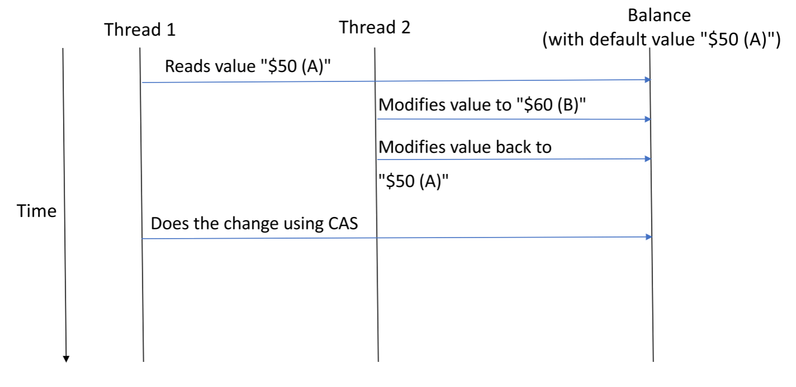

* 目录
{:toc}

# 比较和交换

即compare-and-swap（CAS）

为了了解根本原因，让我们简要回顾一下“compare-and-swap”的概念。

CAS是无锁算法中的一种常用技术，**可以确保如果另一个线程同时修改了相同的空间，则一个线程对共享内存的更新将失败。**

我们通过在每次更新中**使用两条信息来实现此目的：更新后的值（newValue）以及原始值（expectedValue）。** 然后CAS将首先将现有值与原始值进行比较。 如果相等，则将现有值与更新后的值交换。

CAS是一个原子操作，这意味着获取和更新是一个操作。这里重要的是，CAS不获取数据结构上的锁，但是如果更新成功，则返回true，否则返回false。

以下代码片段概述了CAS的工作方式：
```java
volatile int value;
 
boolean cas(int expectedValue, int newValue) {
    if(value == expectedValue) {
        value = newValue;
        return true;
    }
    return false;
}
```

仅当新值仍具有期望值时，我们才用新值更新该值，否则它将返回false。以下代码片段显示了如何调用CAS：
```java
void testCas() {
    int v = value;
    int x = v + 1;
 
    while(!cas(v, x)) {
        v = value;
        x = v + 1;
    }
}
```

我们尝试更新值，直到CAS操作成功。

**但是，线程有可能陷入饥饿状态。** 如果其他线程同时对同一个变量执行CAS，则可能会发生这种情况，因此该操作永远不会针对特定线程成功（或者将花费不合理的时间才能成功）。但是，如果CAS失败，则我们知道另一个线程已成功，因此，我们也确保了全局进度，这是释放锁所必需的。

**重要的是要注意，硬件应支持CAS，以使其成为真正的原子操作而无需使用锁。**

Java在`sun.misc.Unsafe`类中提供了CAS的实现。但是，在大多数情况下，我们不应该直接使用此类，而应使用原子变量（如：`AtomicInteger`，`AtomicLong`，`AtomicBoolean`和`AtomicReference`）。

此外，CAS不能防止A-B-A问题。我们将在下面进行介绍。

# ABA问题

现在，ABA问题是一个异常，仅比较和交换就使我们失败了。

例如，假设一个活动读取了一些共享内存（A），以准备对其进行更新。然后，另一个活动临时修改该共享内存（B），然后将其还原（A）。此后，**一旦第一个活动执行了“比较并交换”，它将看起来好像没有进行任何更改，** 从而使检查的完整性无效。

尽管在很多情况下这不会造成问题，但有时A并不像我们想象的那样等于A。让我们看看实际情况。

## 一个示例

为了通过实际示例演示该问题，让我们研究一个简单的银行帐户类，其中一个整数变量保存实际余额。我们还有两个功能：一个用于提款，一个用于存款。这些操作使用CAS来减少和增加帐户余额。

## 哪里有问题

让我们考虑一下线程1和线程2在同一个银行帐户上运行的多线程方案。

当线程1要取款时，它将读取实际余额，以使用该值稍后比较CAS操作中的金额。但是，由于某种原因，线程1有点慢 -- 可能被阻塞了。

**同时，线程2被挂起时，线程2使用相同的机制对帐户执行两项操作。** 首先，它更改了线程1已读取的原始值，然后，将其更改回原始值。

一旦线程1恢复，它将看起来好像什么都没有改变，并且CAS将成功：



# Java示例

为了更好地可视化，让我们看一些代码。在这里，我们将使用Java，但是问题本身并非特定于语言。

## 账户

首先，我们的Account类将余额保留在`AtomicInteger`中，这为我们提供了Java中整数的CAS。此外，还有另一个`AtomicInteger`可以计算成功交易的数量。最后，我们有一个`ThreadLocal`变量来捕获给定线程的CAS操作失败的次数。

```java
public class Account {
    private AtomicInteger balance;
    private AtomicInteger transactionCount;
    private ThreadLocal<Integer> currentThreadCASFailureCount;
    ...
}
```

## 存款

接下来，我们可以为Account类实现存款方法：

```java
public boolean deposit(int amount) {
    int current = balance.get();
    boolean result = balance.compareAndSet(current, current + amount);
    if (result) {
        transactionCount.incrementAndGet();
    } else {
        int currentCASFailureCount = currentThreadCASFailureCount.get();
        currentThreadCASFailureCount.set(currentCASFailureCount + 1);
    }
    return result;
}
```

请注意，`AtomicInteger.compareAndSet()`只是`AtomicInteger.compareAndSwap()`方法的包装，以反映CAS操作的布尔结果。

## 提款

同样，`withdraw`方法可以创建为：

```java
public boolean withdraw(int amount) {
    int current = getBalance();
    maybeWait();
    boolean result = balance.compareAndSet(current, current - amount);
    if (result) {
        transactionCount.incrementAndGet();
    } else {
        int currentCASFailureCount = currentThreadCASFailureCount.get();
        currentThreadCASFailureCount.set(currentCASFailureCount + 1);
    }
    return result;
}
```

为了演示ABA问题，我们创建了一个`maybeWait()`方法来保存一些耗时的操作，该操作为其他线程提供了一些额外的时间范围以在余额上进行修改。

现在，我们将线程1暂停两秒钟：
```java
private void maybeWait() {
    if ("thread1".equals(Thread.currentThread().getName())) {
        TimeUnit.SECONDS.sleep(2);
    }
}
```

## ABA方案

最后，我们可以编写一个单元测试来检查ABA问题是否可能。

我们要做的是有两个线程，之前的线程1和线程2。线程1将读取余额并被延迟。在线程1处于睡眠状态时，线程2将更改余额，然后将其更改回。

线程1唤醒后，它就不再是明智的选择，并且其操作仍将成功。

进行一些初始化之后，我们可以创建线程1，这将需要一些额外的时间来执行CAS操作。完成此操作后，它不会意识到内部状态已更改，因此，CAS失败计数将为0，而不是ABA情况下的预期1：

```java
@Test
public void abaProblemTest() {
    // ...
    Thread thread1 = new Thread(() -> {
        assertTrue(account.withdraw(amountToWithdrawByThread1));
 
        assertTrue(account.getCurrentThreadCASFailureCount() > 0); // test will fail!
    }, "thread1");
    // ...
}
```

同样，我们可以创建线程2，该线程将在线程1之前完成，并更改帐户余额并将其更改回原始值。在这种情况下，我们预计CAS不会出现任何故障。
```java
@Test
public void abaProblemTest() {
    // ...
    Thread thread2 = new Thread(() -> {
        assertTrue(account.deposit(amountToDepositByThread2));
        assertEquals(defaultBalance + amountToDepositByThread2, account.getBalance());
        assertTrue(account.withdraw(amountToWithdrawByThread2));
 
        assertEquals(defaultBalance, account.getBalance());
 
        assertEquals(0, account.getCurrentThreadCASFailureCount());
    }, "thread2");
    // ...
}
```

运行线程后，线程1将获得预期的余额，尽管它不希望线程2产生额外的两个事务：
```java
@Test
public void abaProblemTest() {
    // ...
 
    assertEquals(defaultBalance - amountToWithdrawByThread1, account.getBalance());
    assertEquals(4, account.getTransactionCount());
}
```

# 基于值与基于引用的方案

在上面的示例中，我们可以发现一个重要的事实 -- 在场景结束时返回的`AtomicInteger`与我们开始时使用的完全相同。除了无法捕获线程2进行的两个额外事务之外，在此特定示例中没有发生异常。

这背后的原因是我们基本上使用了值类型而不是引用类型。

## 基于引用的异常

为了重用引用类型，我们可能会遇到ABA问题。在这种情况下，在ABA方案结束时，我们会获得匹配的引用，因此CAS操作成功，但是，该引用可能指向的对象与原始对象不同。这可能导致歧义。

# 解决方案

现在，我们已经很好地了解了问题所在，下面我们来探讨一些可能的解决方案。

## 垃圾收集

对于引用类型，**垃圾回收（GC）可以在大多数时间保护我们免受ABA问题的困扰。**

当线程1在我们正在使用的给定内存地址上有一个对象引用时，那么线程2所做的任何事情都不会导致另一个对象使用该地址。该对象仍然存在，并且在不保留对其引用之前，其地址不会被重用。

虽然这适用于引用类型，但问题是我们在无锁数据结构中依赖GC。

当然，某些语言不提供GC也是如此。

## 危险指示器

即Hazard Pointers

危险指示器与上一个危险指示器有所关联 -- **我们可以在没有自动垃圾收集机制的语言中使用它们。**

简而言之，线程在共享数据结构中跟踪有问题的指针。这样，每个线程都知道指针所定义的给定内存地址上的对象可能已被另一个线程修改。

现在，让我们来看一些更严格的解决方案。

## 不变性

当然，**使用不可变对象可以解决此问题，因为我们不会在整个应用程序中重复使用对象。** 每当发生更改时，都会创建一个新对象，因此CAS肯定会失败。

但是，我们的最终解决方案还允许使用可变对象。

## 双重比较和交换

即double compare and swap

**双重比较和交换方法的思想是跟踪另一个变量，即版本号，** 然后在比较中也使用它。在这种情况下，如果我们拥有旧版本号，则CAS操作将失败，这仅在其他线程同时修改我们的变量时才可能发生。

在Java中，`AtomicStampedReference`和`AtomicMarkableReference`是此方法的标准实现。


[Introduction to Lock-Free Data Structures with Java Examples](https://www.baeldung.com/lock-free-programming#1-compare-and-swap)

[The ABA Problem in Concurrency](https://www.baeldung.com/cs/aba-concurrency)