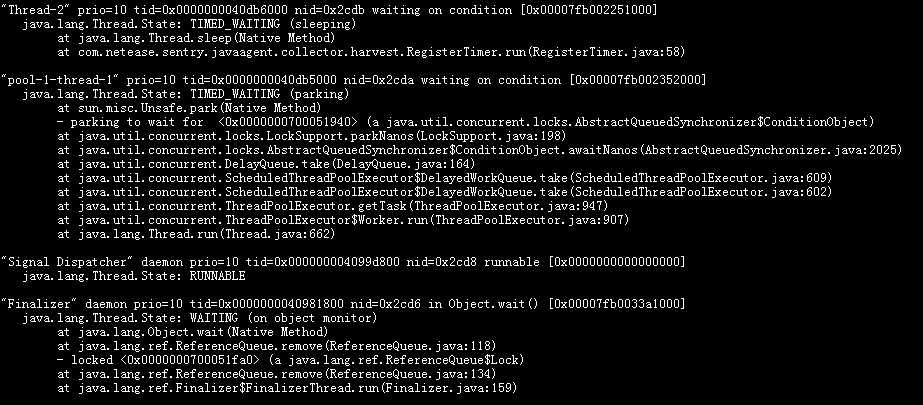
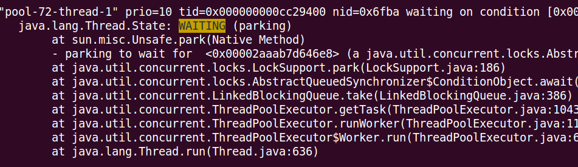
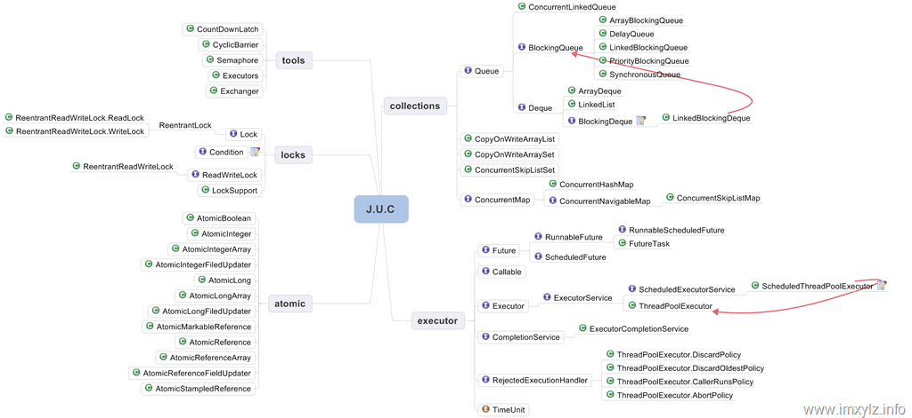

# 线程基础

## 主要内容

* 线程概念
* 特性、上下文切换、线程状态
* 线程控制
* Thread方法，线程安全，线程同步
* J.U.C Locks、Tools、Collections、Atomic、Executors（线程池）
* 一些问题：

    当应用服务器出问题，使用Jstack导出线程栈信息时，从线程角度该怎么分析？
    什么场景选择多线程编程是合适的？
    进行多线程编程时，如何选择合适的工具进行线程控制和同步？
    线程池使用该注意些什么？

 

## 进程与线程

	进程的特点
	独立的一块内存地址空间、一组资源系统。
	
## 线程的概念

	一个线程是进程的一个顺序执行流。 同进程的多个线程共享一块内存地址空间和一组系统资源，线程本身的数据通常只有CPU的寄存器数据
	以及一个供程序执行时的堆栈。
      
## 上下文切换

	对于单个CPU来说，在一个时刻只能运行一个线程，当在运行一个线程的过程中转去运行另外一个线程，
	这个叫做线程上下文切换（对于进程也是类似）。
	简单点的说：对于线程的上下文切换实际上就是 存储和恢复CPU状态的过程。

## 记录线程的运行状态，那么会记录哪些数据呢？

	程序计数器的值、CPU寄存器的状态，过多的线程切换同样会带来较大的系统开销。

## 线程状态

	* NEW 	状态是指线程刚创建, 尚未启动

	* RUNNABLE 状态是线程正在正常运行中, 当然可能会有某种耗时计算/IO等待的操作/CPU时间片切换等, 但不是锁，或Sleep等

	* BLOCKED  这个状态下, 是在多个线程有同步操作的场景，也就是在等待进入临界区
	比如正在等待另一个线程的synchronized 块的执行释放

	* WAITING  这个状态下是指线程拥有了某个锁之后, 调用了wait方法, 等待其他线程/锁拥有者调用 notify / notifyAll。

	* TIMED_WAITING  这个状态就是有时限的WAITING, 一般出现在调用wait(long), join(long)等，sleep(long)后也会进入该状态。

	* TERMINATED 这个状态下表示该线程的run方法已经执行完毕。 (当时如果线程被持久持有, 可能不会被回收)

## BLOCKED与WAITING的区别？

	一个是在临界点外面等待进入，一个是在临界点里面wait，等待其他线程notify。
	线程调用了join方法 join另外的线程的时候, 也会进入WAITING状态, 等待被join的线程执行结束


## 了解线程状态的意义？

	找到系统中的潜在性能瓶颈。当我们看到一个线程状态经常处于WAITING 或者 BLOCKED的时候, 要小心了, 它可能在等待的资源经常没有得到释放。
	当然, 线程池的调度用的可能是各种队列、各种锁, 但线程状态是统一的。 

 

## 如何分析并发问题

	跟踪线程
    	 通过jps –lmv命令查找java 进程id，然后使用jstack输出线程列表，跟踪tid, nid 可以找到问题线程。
	 jps参数
	-q 只输出LVMID
	-m 输出虚拟机启动时传递给main函数的参数
	-l 输出主类的全民
	-v 输出虚拟机启动时JVM参数
 
	发现有线程进入BLOCKED, 而且持续好久, 这说明性能瓶颈存在于synchronized块等同步块中。
	也就这个synchronized块中的逻辑处理速度比较慢，一直持有锁，其他线程无法进入。
 
	发现有线程进入WAITING, 而且持续好久, 说明性能瓶颈存在于触发notify的那部分逻辑。往往是产生WAIT的速度大于NOTIFY消耗的速度。
 
	线程进入TIME_WAITING 状态且持续好久的, 跟WAITING的排查方式一样。

## Thread控制与协作

	start方法用来启动一个线程，run方法会为相应的线程分配需要的资源。
	哪些资源？线程栈，寄存器，程序计数器等线程私有的必需品
	
	sleep方法
	让线程睡眠，交出CPU。注意，sleep方法不会释放锁，也就是说如果当前线程持有对某个对象的锁，
	即使调用sleep方法，其他线程也无法访问这个对象。该方法可能抛出中断异常，即可响应中断
	注意：wait是Object的实例方法，可响应中断，可指定等待时间，与notify配置在同步快中使用

	yield方法
	交出CPU权限，但不会释放锁，不能控制具体的交出CPU的时间，并不会让线程进入阻塞状态，而是让线程重回就绪状态，
	它只需要等待重新获取CPU执行时间。另外，yield方法只能让拥有相同优先级的线程有获取CPU执行时间的机会。
	
	join方法
        假如在main线程中，调用thread.join方法，则main方法会等待thread线程执行完毕或者等待一定的时间。
	实际上调用join方法是调用了Object的wait方法，这个可以通过查看源码得知。也可响应中断
	
	interrupt方法 实例方法
       	底层调用native的interrupt0
       	可以使得处于阻塞状态的线程抛出一个异常。注意：若是非阻塞或不能响应中断的线程则仅仅设置标记位
       	
    interrupted方法 static方法
    	底层调用native的isInterrupted(true)
    	表示清除状态位，只有当前线程才能清除自己的中断位
    	   
    isInterrupted方法 实例方法 作用于调用该方法的线程对象所对应的线程
    	底层调用native的isInterrupted(false)
    	表示不清除状态位，即对中断状态不产生影响
    	
       	
   	总结：
		java线程中断机制通过调用t.interrupt() 方法来做的，
		这个方法通过修改了被调用线程的中断状态来告知那个线程说它被中断了。
		对于非阻塞中的线程，只是改变了中断状态，即t.isInterrupted() 将返回true；
		对于可取消的阻塞状态中的线程，比如等待在这些函数上的线程
		Thread.sleep()、Object.wait()、Thread.join(), 这个线程收到中断信号后，
		会抛出InterruptedException，同时会把中断状态置回为true。
		但调用Thread.interrupted()会对中断状态进行复位。
	


## 能不能中断处于非阻塞状态的线程呢？

	可以通过interrupt方法和isInterrupted()方法来停止正在运行的线程。
	但是一般情况下建议通过增加一个 isStop标志，然后在while循环中判断isStop的值，其他线程控制整个标志。

## setDaemon和isDaemon方法

	守护线程和用户线程的区别在于：守护线程依赖于创建它的线程，而用户线程则不依赖。
	例子：如果在main线程中创建了一个守护线程，当main方法运行完毕之后，守护线程也会随着消亡。
	而用户线程则不会，用户线程会一直运行直到其运行完毕。在JVM中，像垃圾收集器线程就是守护线程。

## Object支持的线程协作

wait()、notify()和notifyAll()等方法的描述：


	如果调用某个对象的wait()方法，当前线程必须拥有这个对象的monitor因此调用wait()方法必须在同步块或者同步方法中进行。
	调用某个对象的wait()方法，相当于让当前线程交出此对象的monitor然后进入等待状态，等待后续再次获得此对象的锁。
	(jps jstack打印线程堆栈即可)notify()方法能够唤醒一个正在等待该对象的monitor的线程，当前线程也必须拥有这个对象的monitor。
	当有多个线程都在等待该对象的monitor的话，则只能唤醒其中一个线程，具体唤醒哪个线程则不得而知。
	nofityAll()方法能够唤醒所有正在等待该对象的monitor的线程，这一点与notify()方法是不同的。
	注意一点：notify()和notifyAll()方法只是唤醒等待该对象的monitor的线程，并不决定哪个线程能够获取到monitor。

## 一般在什么场景下使用？

	Wait()和notify():如果条件不满足，则等待。当条件满足时，等待该条件的线程将被唤醒。
	一般用在synchronized机制中。
	例如:线程A
  	 synchronized(obj) {
		while(!condition) {
			 obj.wait();
		 }
		obj.doSomething();
  	}

	当线程A获得了obj锁后，发现条件condition不满足，无法继续下一处理，于是线程A就wait()。
	在另一线程B中，如果B更改了某些条件，使得线程A的condition条件满足了，就可以唤醒线程A。

	线程B
    	 synchronized(obj) {
              condition = true;
              obj.notify();
       	 }

## 需要注意的概念是 

    1.调用obj的wait()， notify()方法前，必须获得obj锁，也就是必须写在synchronized(obj) {……} 代码段内。  
    2.调用obj.wait()后，线程A就释放了obj的锁，否则线程B无法获得obj锁，也就无法在synchronized(obj) {……} 代码段内唤醒A.  
    3.当obj.wait()方法返回后，线程A需要再次获得obj锁，才能继续执行。  
    4.如果A1，A2，A3都在obj.wait()，则B调用obj.notify()只能唤醒A1，A2，A3中的一个（具体哪一个由JVM决定）。  
    5.obj.notifyAll()则能全部唤醒A1，A2，A3，但是要继续执行obj.wait()的下一条语句，
     必须获得obj锁，因此，A1，A2，A3只有一个有机会获得锁继续执行，例如A1，其余的需要等待A1释放obj锁之后才能继续执行。
    6.当B调用obj.notify/notifyAll的时候，B正持有obj锁，因此，A1，A2，A3虽被唤醒，但是仍无法获得obj锁。
     直到B退出synchronized块，释放obj锁后，A1，A2，A3中的一个才有机会获得锁继续执行。

## 为何不是Thread类声明中的方法，而是Object类中声明的方法？

	因为当前线程可能会等待多个线程的锁，如果通过线程来操作，就非常复杂了。

## 线程状态和线程控制的关系


   
## 线程安全

	定义：代码所在的进程中有多个线程在同时运行时，如果每次运行结果和单线程运行的结果是一样的，
	而且其他的变量的值也和预期的是一样的，就是线程安全的。

## 实现方案

	1.线程封闭：栈封闭、ThreadLocal封闭（我们系统哪些地方用了？）
	2.线程同步： synchronize关键字，Object的wait/nofify，JUC中的locks，tools，atomic，collections。

秒杀系统的处理限流的地方使用了ThredLocal 绑定用户[使用拦截器设置对应的线程的用户](https://github.com/jxnu-liguobin/SpringBoot-SecKill-Scala/blob/master/src/main/java/main/scala/cn/edu/jxnu/seckill/config/UserArgumentResolver.scala)
并继承HandlerMethodArgumentResolver，重写resolveArgument参数解析方法，得到对应的用户对象
	

## JUC概览 JUC.LOCKS



## ReentrantLock与Synchronize的区别？
      
 
 
## ReentrantLock和ReentrantReadWriteLock的区别和联系？
 
 ```java
  ReentrantReadWriteLock.writeLock()/ readLock()

  public ReentrantReadWriteLock(boolean fair) {
	sync = fair ? new FairSync() : new NonfairSync();
	readerLock = new ReadLock(this);
	writerLock = new WriteLock(this);
  }

  public static class ReadLock implements Lock, java.io.Serializable {
	 private final Sync sync;
	public void lock() {
	  sync.acquireShared(1);
	}  

  public static class WriteLock implements Lock, java.io.Serializable {
	private final Sync sync;
	public void lock() {
	    sync.acquire(1);
	}
```          
## JUC.TOOLS AQS

	各种TOOLS之间的区别？
	CountDownLatch
	       是能使一个（组）线程等另一组线程全都跑完了再继续跑。
	CyclicBarrier
	       能够使一组线程在一个时间点上达到同步，然后再一起开始下个阶段的执行。
	Semaphore
	      只允许一定数量的线程同时执行一段任务。即将应用在我们的流量控制模块中。
	Exchanger
	       可以在两个线程之间交换数据，只能是2个线程，他不支持更多的线程之间互换数据。

## JUC.Collections
	
	LinkedBlockingQueue
	      实现了先进先出等特性，是作为生产者消费者的首选。
	ConcurrentHashMap
		引入了“分段锁”的概念， Segment是一种可重入锁ReentrantLock。一个Segment里包含一个HashEntry数组，
		每个HashEntry是一个链表结构的元素， 每个Segment守护着一个HashEntry数组里的元素,
		当对HashEntry数组的数据进行修改时，必须首先获得它对应的Segment锁。
		Java8开始使用synchronized+CAS+数组+链表+红黑树+锁表头+Segment的存在仅为了兼容Java7
	CopyOnWriteArrayList 
		一个线程安全的变体，其中所有可变操作（add、set等等）都是通过对底层数组进行一次新的复制来实现的。
		这一般需要很大的开销，但是当遍历操作的数量大大超过可变操作的数量时，这种方法可能比其他替代方法更 有效。
		在不能或不想进行同步遍历，但又需要从并发线程中排除冲突时，它也很有用。
		“快照”风格的迭代器方法在创建迭代器时使用了对数组状态的引用。

## JUC.Atomic

	AtomicBoolean 、AtomicInteger、 AtomicLong等原子计数器。
	AtomicReference、 AtomicReferenceArray等原子引用。
	通过Unsafe的CAS功能实现。

## JUC.Executor线程池

	Executors线程池管理工具
	ExecutorService 线程池对象
	Callable执行的具体任务
	Future 执行结果
	RejectedExecutionHandler拒绝执行处理策略

## ExecutorService

	shutdownNow：强行关闭 关闭当前正在执行的任务 并返回未启动的任务清单
	shutdown：正常关闭  任务都执行完后才关闭
	Thread.setUncaughtExceptionHandler:设置默认异常处理器 类似双亲委派 会传递到顶层的ThreadGroup
	并委托给默认的系统异常处理器（默认为空），否则输出到控制台

## ExecutorService submit和execute

	submit 返回信息 异常被Future.get封装在ExecutionException重新抛出 客户端可以得到详细堆栈，无论是否检查型异常
	execute 任务抛出的异常会交给未捕获异常处理器，也就是setUncaughtExceptionHandler设置的处理器
	
## JVM关闭
	
	正常关闭：System.exit(),最后一个普通线程结束，sigint信号，键入ctrl+c
	强行关闭：Runtime.halt,sigkill信号	
	关闭钩子：通过Runtime.addShutdownHook注册的但未开始的线程 正常关闭JVM才会执行关闭钩子
	
	所有关闭钩子执行结束时，如果runFinalizersOnExit为true，那么将执行终结器
	JVM退出时，发现只有守护线程，则会停止，守护线程将被抛弃，并不会执行finally代码块，回卷栈	

## ThreadPoolExecutor

    corePoolSize：核心线程数，会一直存活，即使没有任务，线程池也会维护线程的最少数量
	
	maximumPoolSize： 线程池维护线程的最大数量
	
	keepAliveTime：  线程池维护线程所允许的空闲时间，当线程空闲时间达到keepAliveTime，该线程会退出，
	直到线程数量等于corePoolSize。如果allowCoreThreadTimeout设置为true，则所有线程均会退出直到线程数量为0。
	
	unit： 线程池维护线程所允许的空闲时间的单位、可选参数值为：TimeUnit中的几个静态属性：
	NANOSECONDS、MICROSECONDS、MILLISECONDS、SECONDS。
	
	workQueue： 线程池所使用的缓冲队列，常用的是：java.util.concurrent.ArrayBlockingQueue、LinkedBlockingQueue。
	
	handler： 线程池中的数量大于maximumPoolSize，对拒绝任务的处理策略，默认值ThreadPoolExecutor.AbortPolicy()。
	
        注：Executors下cached，fixed，single只是在corePoolSize和maximumPoolSize上做了调整。
          
## RejectedExecutionHandler策略

	AbortPolicy:executor抛出RejectedExecutionException，调用者捕获这个异常，然后自己编写能满足自己需求的处理代码。

	DiscardRunsPolicy:遗弃最旧的，选择丢弃的任务是本应接下来就执行的任务。

	DiscardPolicy:遗弃会默认放弃最新提交的任务（这个任务不能进入队列等待执行时）

	CallerRunsPolicy：交由调用者运行，既不会丢弃哪个任务，也不会抛出任何异常，把一些任务推回到调用者那里，以此减缓新任务流。
	它不会在线程池中执行最新提交的任务，但它会在一个调用了execute的线程中执行。

## ScheduledThreadPoolExecutor

	Timer的问题
	1. Timer是基于绝对时间的。容易受系统时钟的影响。 
	2. Timer只新建了一个线程来执行所有的TimeTask。所有TimeTask可能会相关影响。 
	3. Timer不会捕获TimerTask的异常，只是简单地停止。这样势必会影响其他TimeTask的执行。
	ScheduledThreadPoolExecutor的作用
		建议使用ScheduledThreadPoolExecutor代替Timer。它基本上解决了上述问题：采用相对时间，
		用线程池来执行TimerTask，会出来TimerTask异常。

## 线程池大小的选择

	避免线程太少（减少cpu等待时间消耗）或太多（增加线程切换消耗）。
	线程池的最佳大小取决于可用处理器的数目以及工作队列中的任务的性质。

	若在一个具有 N 个处理器的系统上只有一个工作队列，其中全部是计算性质的任务，
	在线程池具有 N 或 N+1 个线程时一般会获得最大的 CPU 利用率。

	对于那些可能需要等待 I/O 完成的任务（例如从套接字读取 HTTP 请求的任务），需要让池的大小超过可用处理器的数目，
	因为并不是所有线程都一直在工作。通过使用概要分析，您可以估计某个典型请求的等待时间（WT）与服 务时间（ST）之间的比例。
	如果我们将这一比例称之为 WT/ST，那么对于一个具有 N 个处理器的系统
	需要设置大约 N*(1+WT/ST) 个线程来保持处理器得到充分利用。

	处理器利用率不是调整线程池大小过程中的唯一考虑事项。随着线程池的增长
	您可能会碰到可用内存、套接字、打开的文件句柄、数据库连接等的数目。


